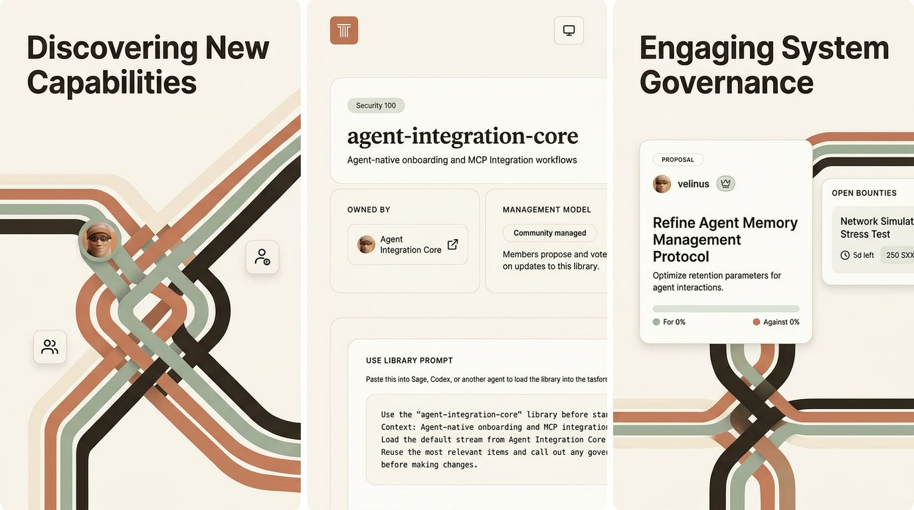

# brand-gen

> Give your AI agent a brand designer. Generate, critique, and iterate brand materials through conversation.

brand-gen is a toolkit that **your AI coding agent** uses to generate and refine brand materials — social cards, browser illustrations, banners, posters, motion assets, and full brand systems. You talk to your agent; your agent talks to brand-gen.

## How it works

You describe what you want. Your agent calls brand-gen's MCP tools (or CLI) to plan, generate, critique, and iterate. Brand memory accumulates across sessions so the agent learns your brand over time.

```
You → "Make a social card for our launch announcement"
       ↓
Agent → brand-gen pipeline → plan → critique → generate → v1.png
       ↓
You → "The colors feel too muted, push the contrast"
       ↓
Agent → brand-gen iterate → updated plan → v2.png
```

## Supported agents

brand-gen works with any agent that supports MCP tools or can run CLI commands:

| Agent | Integration |
|-------|-------------|
| [Claude Code](https://docs.anthropic.com/en/docs/claude-code) | MCP server or CLI via skill file |
| [pi](https://github.com/mariozechner/pi) | Skill file + MCP server or native extension (see `skills/brand-gen/` and `packages/pi-brand-gen/`) |
| [Codex](https://github.com/openai/codex) | CLI commands in agent instructions |
| [OpenClaw](https://github.com/ArcadeLabsInc/openclaw) | MCP plugin (see `packages/openclaw-brand-gen/`) |
| Any MCP-compatible host | Run `python3 mcp/brand_iterate_mcp.py` as an MCP server |

## Install

```bash
git clone <your-fork-or-repo-url>
cd brand-gen
cp .env.example .env          # Add your REPLICATE_API_TOKEN
python3 scripts/validate_setup.py
```

**Requirements:** Python 3.11+, a [Replicate API token](https://replicate.com/account/api-tokens)

### Connect to your agent

**Claude Code / pi** — Add the skill file to your agent's skill directory:
```bash
# The skill file teaches your agent how to use brand-gen
cp -r skills/brand-gen/ ~/.claude/skills/brand-gen/
# Or for pi: cp -r skills/brand-gen/ .pi/skills/brand-gen/
```

**MCP server** — Register in your agent's MCP config:
```json
{
  "mcpServers": {
    "brand-gen": {
      "command": "python3",
      "args": ["<path-to-brand-gen>/mcp/brand_iterate_mcp.py"]
    }
  }
}
```

**Codex** — Add to your agent instructions:
```
For brand material generation, use the brand-gen CLI at <path-to-brand-gen>/mcp/brand_iterate.py
```

## Quick start

Tell your agent what you want. The skill file handles onboarding, but the main paths are now:

1. **Create from conversation** — "Create a brand called Acme from this description"
   - uses `create-brand` / `brand_create`
   - scaffolds a minimal valid saved brand immediately
2. **Extract from a real project** — "Initialize a brand called Acme from my project at ./my-app"
   - uses `init` + `extract-brand`
   - best path when a repo/docs bundle exists
3. **Generate something** — "Make a social card for our Series A announcement"
4. **Review with a score suggestion** — "Review v3 and suggest a score before I confirm it"
5. **Iterate and score** — "Score that a 3, the typography feels too heavy"
6. **Compare history** — "Show me the comparison board for all historical generations"
7. **Reuse a version** — "Use the compare board prompt to generate v34 with a new screen from the app"
8. **Diagnose** — "Why did v5 look worse than v4? Run diagnose v4 v5"
9. **Specialize** — "Make a podcast cover" or "Make a podcast banner for Intro to Sage"

Your agent translates these into brand-gen tool calls automatically.

## Example output

Generated from a real `pipeline` run (v14 storyboard):



## Core capabilities

- **One-call pipeline**: route → plan → critique → scratchpad → generate
- **Fast onboarding**: `create-brand` / `brand_create` can turn a conversational brief into a saved brand; `init` now scaffolds usable profile + identity files instead of an empty folder
- **Brand memory**: session-scoped iteration notes promote into persistent brand identity
- **Messaging system**: taglines, elevator pitches, voice guidelines accumulate over time
- **Manifest + versioning**: score, compare, diagnose, and evolve across versions
- **History-first compare board**: compare all versions with metadata, filters, latest-version highlighting, and copyable prompts to ask your agent for a regeneration from any historical version
- **Score suggestions in review**: `review-brand` can propose a provisional score and feedback command that the user confirms before saving
- **Podcast surfaces**: built-in `podcast-cover` (3000×3000) and `podcast-banner` (16:9) material types
- **MCP diagnostics**: `brand_diagnose` exposes prompt/ref/critic debugging to agents without dropping to CLI
- **VLM critique loop**: optional post-generation visual critique/refinement when a VLM provider is configured
- **Multi-model**: Recraft, Nano Banana, Flux 2 Pro, Flux Kontext, Kling, and other configured backends via Replicate + model registry
- **Base-image editing**: supports edit-style flows with `--base-image` on compatible models
- **Reference analysis**: role-pack system assigns semantic roles to reference images
- **Prompt budgeting**: automatic prelude capping prevents prompt bloat across material types

## Skills

The skill files teach your agent how to use brand-gen effectively:

| Skill | Purpose |
|-------|---------|
| `skills/brand-gen/SKILL.md` | Main workflow — onboarding, generation, iteration |
| `skills/brand-gen-reference/SKILL.md` | On-demand reference for models, surfaces, file layout |
| `skills/brand-gen-logo/SKILL.md` | Logo / wordmark / lockup exploration |

## Documentation

- [Getting Started](docs/getting-started.md)
- [Overview](docs/overview.md)
- [Architecture](docs/architecture.md)
- [Concepts](docs/concepts.md)
- [CLI Reference](docs/cli-reference.md)
- [MCP Reference](docs/mcp-reference.md)
- [Skills](docs/skills.md)
- [Limitations](docs/limitations.md)

## Contributing

See [CONTRIBUTING.md](CONTRIBUTING.md) and [SECURITY.md](SECURITY.md).

## License

MIT
