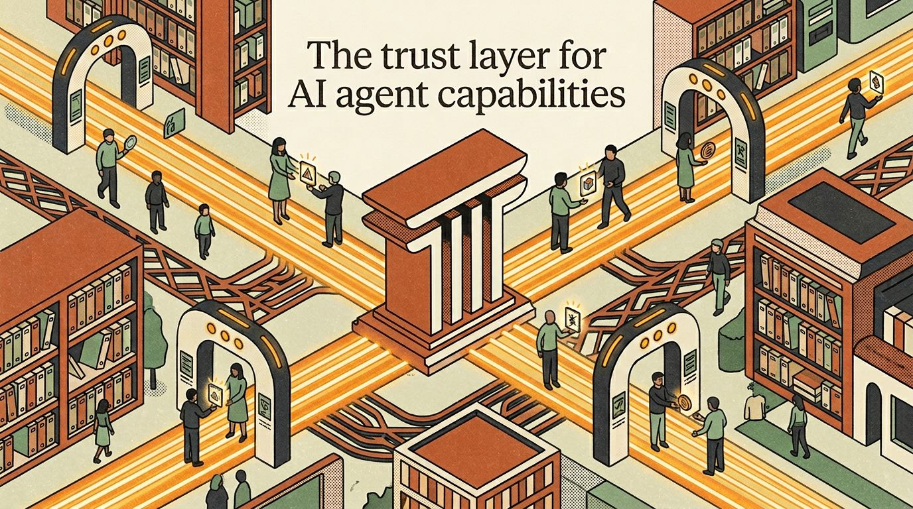

# brand-gen

[](https://www.python.org/downloads/)
[](LICENSE)
[](https://replicate.com)
[](#agent-reference)

> A multi-agent brand design system. You talk to your agent; it runs a team of specialists - philosopher, planner, critic, cinematographer, generator - through a planning-first pipeline with quality gates.

brand-gen is **not a CLI you drive by hand**. It's a coordinated pipeline of seven agents that share file-backed state (brand identity, design philosophy, custom scratchpad, iteration memory, learnings, design tokens) and call a local `bgen` runtime under the hood. The CLI exists, but it's the substrate the agents use - not the primary interface.

Works with any agent host that has shell access: Claude Code, Pi, OpenClaw, MCP hosts, Codex, Cursor.

A launch card the seven-agent pipeline produced from a one-sentence brief:



## The agent pipeline

```text
You → "Make a launch card for our product announcement"
       ↓
brand-orchestrator
       ↓
┌────────────────────────────────────────────────────────────────┐
│ Phase 1 - Prepare                                              │
│   brand-explorer        workspace, blackboard, learnings       │
│   brand-philosopher     design-philosophy.md, motion grammar   │
│                         export-design-tokens + WCAG audit       │
│                         custom-scratchpad.md curation          │
│ Phase 2 - Plan                                                 │
│   brand-router          route selection                        │
│   brand-planner         plan-draft with role-pack + layout     │
│ Phase 3 - Validate                                             │
│   brand-critic          critique-plan, validate-brand-fit      │
│                         blocks on P1 issues                     │
│ Phase 4 - Generate                                             │
│   brand-cinematographer (video only) 7-rule shot validation    │
│   brand-generator       build scratchpad, generate → v1.png    │
│ Phase 5 - Critique                                             │
│   brand-critic          score, WCAG audit on HTML renders,     │
│                         append forbidden patterns, iterate     │
│ Phase 6 - Evolve                                               │
│   brand-orchestrator    evolve, record learnings                │
└────────────────────────────────────────────────────────────────┘
       ↓
You → "Tighter hierarchy, keep the copy direction"
       ↓
pipeline re-enters with --source-version, learnings auto-applied
```

The pipeline is planning-first and quality-gated: **no freehand generation before a plan is critiqued**. Agents communicate through shared files (plans, scratchpads, blackboard, iteration memory, custom scratchpad) rather than passing data in-memory.

## Requirements

- Python 3.11+
- [Replicate API token](https://replicate.com/account/api-tokens) (image + video generation backend)
- An agent host with shell access (Claude Code, Pi, Cursor, Codex, or any MCP host)
- ~500 MB disk for a working brand workspace

## Install

```bash
git clone https://github.com/velinussage/brand-gen.git
cd brand-gen
python3 -m venv .venv && source .venv/bin/activate
python3 -m pip install -e .
cp .env.example .env          # add your REPLICATE_API_TOKEN
python3 scripts/validate_setup.py
```

## Quick start - talk to your agent

Agent-driven (the intended path):

```text
Read skills/brand-gen/SKILL.md and .claude/agents/brand-orchestrator.md,
then run brand-orchestrator on this task:

  Create an x-feed launch announcement for <brand>.
```

Your agent will run `brand-explorer` to inspect the workspace, `brand-philosopher` to ensure a design philosophy exists, audit WCAG contrast, plan the shot, critique the plan, generate, and critique the output - stopping for your input at the critique and feedback steps.

If your host supports subagent tooling directly (Claude Code, Pi):

```text
/run brand-orchestrator "x-feed launch announcement for <brand>"
```

## Direct CLI (for power users and scripting)

The `bgen` commands are what the agents call. You can call them too when you want to bypass the agent layer - useful for scripting, CI, or inspecting intermediate artifacts:

```bash
# Create a brand
bgen create-brand \
  --name "Acme" \
  --description "Operational software for modern field teams" \
  --tone "calm,technical,trustworthy" \
  --palette "#1A6B6B,#C85A2A"

# Run the pipeline in-process (skips agent layer, keeps planning gate)
bgen pipeline \
  --material-type x-feed \
  --goal "Launch announcement" \
  --mode hybrid \
  --format json

# Review and iterate
bgen feedback v1 --score 4 --notes "Strong direction, simplify the copy"
bgen pipeline --material-type x-feed --source-version v1 --format json
```

`bgen pipeline` runs the same planning-first gate as the agent orchestration, just without agent-level reasoning between phases. Prefer the agent path when you want the philosopher's WCAG fix, the critic's P1 push-back, or the cinematographer's shot-design validation. Use direct `bgen` calls when you already know the answers.

## Skills

brand-gen ships as skill files any agent can read. No host-specific plugin required.

| Skill | Purpose |
|-------|---------|
| `skills/brand-gen-setup/SKILL.md` | First-time install and host wiring |
| `skills/brand-gen/SKILL.md` | Workspace, planning, generation, review, iteration |
| `skills/brand-gen-orchestration/SKILL.md` | Full 6-phase generation pipeline with quality gate |
| `skills/brand-gen-reference/SKILL.md` | Model specs, surface dimensions, file layout |
| `skills/brand-gen-logo/SKILL.md` | Logo and wordmark workflows |
| `skills/brand-content-ideation/SKILL.md` | Messaging and copy ideation |

## What the pipeline does

These are the capabilities the agents coordinate through. Each maps to shared files agents read and write - not commands users run directly.

- **Planning-first gate**: the critic blocks generation until a plan is approved. No freehand prompts.
- **Durable brand memory**: saved profiles, identity, blackboard, iteration memory, and learnings - agents read these every run and write back after feedback
- **Review loop**: rubric-first critique, scoring, feedback, and evolution analysis; winning setups auto-promote into `learnings.json` and fire automatically on the next run
- **Messaging system**: ideate, persist, and promote approved copy across sessions
- **HTML share cards**: deterministic rendering with plugin-based data fetching; the generator consumes the brand's audited `design-tokens.css` when present
- **Derivatives**: extend approved stills into mockups or short-form video
- **Reference workflows**: capture product screenshots, consolidate inspiration, assign reference roles

Three capabilities deserve their own section because they're how the new agent pipeline coordinates - via shared files.

### Custom scratchpad (how agents teach each other)

Every brand workspace carries an agent-editable scratchpad that auto-injects into every prompt and auto-applies to model selection:

```
.brand-gen/brands/<brand>/
├── custom-scratchpad.md     # style directives, motion grammar, bans
└── custom-scratchpad.json   # {model_overrides_by_material, forbidden_patterns[]}
```

- `brand-philosopher` writes style directives and motion grammar directly
- `brand-critic` appends forbidden patterns after any P1 finding (closed loop: critique → ban → next run auto-bans)
- `brand-orchestrator` reads both files in Phase 1 and applies model overrides before the learnings lookup

The contents land in prompt assembly alongside iteration memory and blackboard learnings. No agent touches `bgen` for this; they edit the files directly.

### Design tokens + WCAG audit (how the philosopher gates palettes)

The philosopher runs `bgen export-design-tokens` in Step 7b of its workflow to emit production-ready tokens (CSS / Tailwind / JSON / W3C DTCG) derived mathematically from `brand-identity.json`. Every emit runs a WCAG AA audit. Errors block emission. The philosopher adjusts the palette until AA passes, at most twice, then escalates to the user with specific options.

The generator consumes the resulting `design-tokens.css` when rendering HTML materials. The critic re-runs the audit against what actually rendered.

Coverage: 50-950 shade scales, math-derived type scale, base-4 spacing, elevation shadows keyed to the brand's neutral, radii, motion tokens, breakpoints, smart font-family fallback chains. Full reference at `skills/brand-gen/references/design-tokens.md` (distilled from dylanfeltus/design-tokens, pbc-os/brand-identity, and anthropics/brand-guidelines).

Direct CLI available for scripting:

```bash
bgen export-design-tokens --output-format css       --format json
bgen export-design-tokens --output-format w3c       --format json
```

### Video materials (the cinematographer path)

For `short-video`, `derive-video`, `motion-card`, `launch-film`, `announcement-video`, or `brand-bumper`, the orchestrator inserts `brand-cinematographer` between planner and generator.

The cinematographer:

1. Reads the motion grammar that `brand-philosopher` wrote into `custom-scratchpad.md` (director token, favored camera moves, banned moves, intensity, lighting recipe, film stock, organic imperfections).
2. Assembles the six-element Seedance prompt (subject + action + setting + visual style + focal length/camera + audio).
3. Runs the seven-rule validation from `skills/brand-gen/references/seedance-shot-design.md` (length, time slices, camera literacy, filler-word bans, asset caps, conflict scan, bare-word scrub).
4. Hands a shot-ready scratchpad to `brand-generator`.

If the brand has no motion grammar, the cinematographer refuses to generate and delegates back to `brand-philosopher` to establish one. The `seedance-2-pro` model is registered in `brand_gen/models.json`. `bgen create-video` runs a brief-driven multi-shot launch film with xfade stitching and per-shot validation; every shot is gated before generation fires.

## Host integration

Point your agent at the skill files and the right agent directory for its host:

```text
Read these skill files and follow them for brand material work:
- skills/brand-gen-setup/SKILL.md (first-time only)
- skills/brand-gen/SKILL.md (workspace + workflow)
- skills/brand-gen-orchestration/SKILL.md (full pipeline)

Then run the brand-orchestrator agent from .claude/agents/brand-orchestrator.md
(or .pi/agents/brand-orchestrator.md for Pi). Start by running:
  bgen context-snapshot --format json
```

For MCP hosts that prefer a direct tool surface over the agent layer:

```bash
python3 -m brand_gen.brand_iterate_mcp    # stdio MCP server
```

See [docs/host-setup.md](docs/host-setup.md) for Claude Code, Pi, and OpenClaw setup, and [docs/starter-prompts.md](docs/starter-prompts.md) for copy-paste prompts.

## Agent reference

brand-gen ships agent definitions for two hosts, with identical bodies (only frontmatter differs). Other hosts can read the same files and emulate the chain manually.

- **Claude Code** - `.claude/agents/brand-*.md` (mirrored to `skills/brand-gen/claude-agents/brand-*.md`). Invoke via the `Agent` tool with `subagent_type="brand-orchestrator"` or any specialist name.
- **Pi** - `.pi/agents/brand-*.md`. Invoke via `/run brand-orchestrator <task>` or chain syntax.

The intended entry point is always `brand-orchestrator`. Do not jump straight to `bgen generate` or treat `bgen pipeline` as a freehand shortcut.

### Specialist agents

- `brand-orchestrator` - coordinates the full workflow; in Phase 1 runs `export-design-tokens` and delegates WCAG failures to the philosopher
- `brand-explorer` - reads workspace state, blackboard, learnings, recent versions
- `brand-router` - chooses the correct route before planning
- `brand-planner` - creates the plan draft with learnings, layout, and role-pack context
- `brand-critic` - blocks bad plans, scores outputs, runs WCAG contrast audits on HTML share cards, and appends forbidden patterns directly into `custom-scratchpad.json`
- `brand-generator` - builds the scratchpad and runs generation from an approved plan; prefers the brand's `design-tokens.css` when rendering HTML
- `brand-philosopher` - creates or refines `design-philosophy.md`, curates `custom-scratchpad.md` (style directives + motion grammar), and fixes WCAG failures by adjusting `brand-identity.json`
- `brand-cinematographer` - video-prompt specialist; reads motion grammar and the seedance shot-design reference, assembles the six-element prompt, runs seven-rule validation before handoff to `brand-generator`

### Mandatory generation sequence

For any real generation request, the intended order is:

1. **Explorer** - inspect workspace, blackboard, learnings, prior winners, references
2. **Philosopher** - verify / cultivate design philosophy; Phase 1 tokens audit (WCAG AA gate)
3. **Router** - choose the route (`reference_translate`, `generative_explore`, etc.)
4. **Planner** - run preparation and produce `plan-draft`
5. **Critic** - run `critique-plan` and `validate-brand-fit`; block if invalid
6. **Cinematographer** (video only) - run seven-rule shot-design validation
7. **Generator** - run `build-generation-scratchpad` and `generate` only after approval
8. **Critic again** - run `critique-rubric` + WCAG audit on HTML renders; decide approve vs iterate; append bans to custom-scratchpad
9. **Orchestrator** - record `feedback`, run `evolve`, and summarize

If steps 1-5 are skipped, the workflow is invalid. No freehand generation before the plan is critiqued.

### How agents map to `bgen` commands

Agents wrap the normal command surface rather than replacing it:

- `brand-explorer` → `context-snapshot`, `show-blackboard`, `show`, `capabilities`
- `brand-router` → route selection from workspace state and router rules
- `brand-planner` → `suggest-role-pack`, `suggest-layout`, `plan-draft`
- `brand-critic` → `critique-plan`, `validate-brand-fit`, then `critique-rubric`, `submit-critique`, `feedback`; WCAG audit via `export-design-tokens`
- `brand-generator` → `build-generation-scratchpad`, `generate` (consumes `design-tokens.css` for HTML renders)
- `brand-philosopher` → direct edits to `design-philosophy.md`, `custom-scratchpad.md`, and (indirectly) `brand-identity.json` after WCAG failures
- `brand-cinematographer` → `build-generation-scratchpad` for video materials using seedance shot-design discipline
- `brand-orchestrator` → enforces the order, runs `export-design-tokens` in Phase 1, and runs `evolve` at the end

So the real flow is:

```text
agents → inspect → route → plan → validate → generate → critique → evolve
            ↓
         bgen commands execute each stage, files on disk carry state between them
```

### Manual chain rule

If your host cannot run the agent chain automatically, emulate the same order manually:

```text
brand-explorer -> brand-router -> brand-planner -> brand-critic -> brand-generator -> brand-critic
```

Include `brand-router` in the chain. It is part of the intended process, not an optional extra.

For video materials, insert `brand-cinematographer` between planner and generator:

```text
brand-explorer -> brand-router -> brand-planner -> brand-critic -> brand-cinematographer -> brand-generator -> brand-critic
```

If the brand has no `## Motion grammar` section in its `custom-scratchpad.md`, the cinematographer will stop and delegate back to `brand-philosopher` to establish one before any video generates.

## Documentation

- [Getting Started](docs/getting-started.md) - clone to first asset
- [Architecture](docs/architecture.md) - runtime layers, state model, command registry
- [CLI Reference](docs/cli-reference.md) - full command list
- [MCP Reference](docs/mcp-reference.md) - tool naming and custom tools
- [Host Setup](docs/host-setup.md) - Claude Code, Pi, OpenClaw integration
- [Starter Prompts](docs/starter-prompts.md) - copy-paste agent prompts
- [Concepts](docs/concepts.md) - workspace, brands, sessions, blackboard
- [Skills](docs/skills.md) - loading order and skill details
- [Limitations](docs/limitations.md)

## Example output

A brand scene the pipeline produced after the philosopher established a "rammed-earth reading room" visual language:


## Getting help

- Bug reports and feature requests: [github.com/velinussage/brand-gen/issues](https://github.com/velinussage/brand-gen/issues)
- Security policy: [SECURITY.md](SECURITY.md)

## Contributing

See [CONTRIBUTING.md](CONTRIBUTING.md).

## License

[MIT](LICENSE) © brand-gen maintainers
