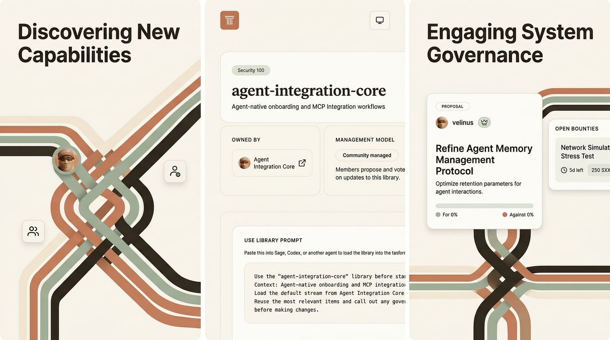

# brand-gen

> Give your AI agent a brand designer. Generate, critique, and iterate brand materials through conversation.

brand-gen is a local, file-backed toolkit that an AI agent can use to understand a brand, plan materials, generate assets, review them, and learn over time. It is designed to work for any brand and across multiple agent hosts — CLI-first agents, MCP hosts, Pi, OpenClaw, and host-specific skill systems.

## What you need

- Python 3.11+ and a [Replicate API token](https://replicate.com/account/api-tokens)
- 5 minutes
- Optional: an Obsidian vault or brand docs folder (not required to get started)
- Optional: Pi or OpenClaw if you want a host integration (the CLI works standalone)

## How agents use brand-gen

brand-gen ships as skill files that any agent can read. No host-specific plugin is required.

**Core skills** (load in this order):
1. `skills/brand-gen-setup/SKILL.md` — first-time install and validation
2. `skills/brand-gen/SKILL.md` — workspace inspection, onboarding, review, iteration
3. `skills/brand-gen-orchestration/SKILL.md` — full 6-phase generation pipeline with quality gate and learning loop
4. `skills/brand-gen-reference/SKILL.md` — model specs, surface dimensions, file layout (load on demand)

**Optional skills:**
- `skills/brand-gen-logo/SKILL.md` — logo and wordmark workflows
- `skills/brand-content-ideation/SKILL.md` — messaging and copy ideation

**Host integrations** (optional, adds convenience features):
- **Pi**: `.pi/agents/` multi-agent pipeline with parallel subagents — see `packages/pi-brand-gen/`
- **OpenClaw**: MCP bridge plugin — see `packages/openclaw-brand-gen/`
- **Claude Code / Codex / CLI**: skills work directly, no plugin needed

## Default manual flow for non-Pi agents

If your agent is not running the Pi subagents directly, it should still follow the orchestrator flow manually instead of jumping straight to `bgen pipeline` or freehand generation.

Start from `.pi/agents/brand-orchestrator.md` and emulate this order:

1. **brand-explorer behavior** — inspect workspace, blackboard, recent winners, and active brand state
2. **brand-router behavior** — choose the route before planning
3. **brand-planner behavior** — build the plan draft
4. **brand-critic behavior** — critique the plan before generation
5. **brand-generator behavior** — generate only after the plan is approved

Default inputs for that flow:
- use the active `logo.png` / resolved brand mark when relevant
- use proven winners such as prior approved versions (`v012`, `v021`, `v048`, or whichever strong versions actually exist)
- use blackboard recipe hints and learned setup guidance
- avoid direct freehand generation until the plan has been critiqued

If you want this behavior in a host-neutral way, load `skills/brand-gen-orchestration/SKILL.md` and follow it before any generation request.

## Copy-paste starter prompts

Paste one of these into your agent. These prompts use full GitHub links so the agent can inspect the docs immediately. After cloning, it should use the local checkout for commands and edits.

<details>
<summary>1) Clone, install, and wire up brand-gen for first use</summary>

```text
I want you to set up brand-gen from scratch and make it ready for agent-driven brand material work.

Clone `https://github.com/velinussage/brand-gen`, install it, validate the environment, and then read the usage skills so you know how to operate it:

- https://github.com/velinussage/brand-gen/blob/main/skills/brand-gen-setup/SKILL.md
- https://github.com/velinussage/brand-gen/blob/main/skills/brand-gen/SKILL.md
- https://github.com/velinussage/brand-gen/blob/main/skills/brand-gen-reference/SKILL.md
- https://github.com/velinussage/brand-gen/blob/main/skills/brand-gen-orchestration/SKILL.md

If I am using Pi as my default host, also follow:

- https://github.com/velinussage/brand-gen/blob/main/packages/pi-brand-gen/README.md

After setup, run:

- `bgen context-snapshot --format json`
- `bgen workspace-status --format json`
- `bgen capabilities --format json`

Then tell me whether brand-gen is ready, what workspace is active, and what my next best step is to create or connect a brand.
```

</details>

<details>
<summary>2) Establish a first brand from conversation, then generate first illustrations</summary>

```text
I want to establish my first brand in brand-gen and generate the first illustrations with you.

Read these files first:

- https://github.com/velinussage/brand-gen/blob/main/skills/brand-gen/SKILL.md
- https://github.com/velinussage/brand-gen/blob/main/skills/brand-gen-orchestration/SKILL.md
- https://github.com/velinussage/brand-gen/blob/main/skills/brand-content-ideation/SKILL.md
- https://github.com/velinussage/brand-gen/blob/main/prompts/brand-reverse-interview-intake.md
- https://github.com/velinussage/brand-gen/blob/main/prompts/brand-concept-exploration.md
- https://github.com/velinussage/brand-gen/blob/main/prompts/non-interface-brand-brief.md

Start by interviewing me to create a strong first brand brief. Then either:

- create a durable saved brand with `bgen create-brand`, or
- start a testing session with `bgen start-testing` if that is safer

After that, propose 2-3 first material directions, help me choose one, and generate the first branded illustration or social asset. Start by checking the active workspace with `bgen context-snapshot --format json`.
```

</details>

<details>
<summary>3) Connect an existing repo or brand-material workspace, then generate from it</summary>

```text
I already have a repo, docs bundle, or existing brand materials and I want to connect them to brand-gen instead of starting from scratch.

Read these files first:

- https://github.com/velinussage/brand-gen/blob/main/skills/brand-gen/SKILL.md
- https://github.com/velinussage/brand-gen/blob/main/skills/brand-gen-reference/SKILL.md
- https://github.com/velinussage/brand-gen/blob/main/prompts/brand-description-extraction.md
- https://github.com/velinussage/brand-gen/blob/main/prompts/product-presentation-reference-brief.md

Inspect the current workspace with `bgen context-snapshot --format json`.

If no saved brand exists yet, extract one from my project or materials with the appropriate brand-gen workflow. If a brand already exists, connect to it and summarize what the system already knows.

Then recommend the best first generated asset to make from the available materials — for example a browser illustration, landing hero, x-feed card, or brand scene — and generate it.
```

</details>

<details>
<summary>4) Use Pi as the default host and generate a first asset</summary>

```text
I want Pi to be my default host for brand-gen.

First install Pi itself by following the official quickstart at:

- https://github.com/badlogic/pi-mono/blob/main/packages/coding-agent/README.md

Then follow:

- https://github.com/velinussage/brand-gen/blob/main/README.md
- https://github.com/velinussage/brand-gen/blob/main/packages/pi-brand-gen/README.md
- https://github.com/velinussage/brand-gen/blob/main/skills/brand-gen/SKILL.md

Make sure the Pi extension is configured correctly, then verify it with:

- `/brand-gen status`
- `/brand-gen brands`
- `/brand-gen summary`

After verification, if no brand exists yet, have me create one with `bgen create-brand` or `bgen start-testing`. If a saved brand already exists, use `/brand-gen brands` and `/brand-gen switch <brand>` to activate it. Then generate a first `x-feed`, `browser-illustration`, or `brand-scene` asset through the Pi workflow.
```

</details>

## Local Configuration

Pi agents need a `.brand-gen-local.json` file at the repo root for machine-specific paths. This file is created automatically during setup — the agent detects the repo root and asks about optional vault paths.

If you need to create it manually:
```bash
cp .brand-gen-local.json.example .brand-gen-local.json
```

Fields:
- `repo_root` — absolute path to the brand-gen checkout (auto-detected from `pwd` during setup)
- `vault_paths` — optional Obsidian vault or brand docs folders (agent asks during setup if you have one)

Creative defaults (quality benchmarks, concept categories, metaphor vocabulary) live in each brand's `brand-profile.json` under `creative_context` and are seeded automatically when you create a brand.

This file is gitignored.

## Example output

Generated from a real `pipeline` run (v14 storyboard):



Another real session output (v028 brand scene):


## Core capabilities

- **One-call pipeline**: route → plan-draft → critique-plan → build-generation-scratchpad → generate
- **Multiple onboarding paths**: activate a saved brand, extract one from a repo/docs bundle, or start from a conversational brief
- **Durable brand memory**: saved `brand-profile.json` and `brand-identity.json` plus session-scoped blackboard, iteration memory, run artifacts, and plugin learnings
- **Planning-first generation**: prompt review, route selection, role-pack suggestion, and set planning before rendering
- **Review loop**: rubric-first critique flow, compare/diagnose views, scoring, feedback, and evolve analysis
- **Messaging system**: ideate, persist, and promote approved messaging across sessions
- **HTML share cards**: deterministic HTML-rendered share cards with plugin-based source fetching and headless Chrome PNG export
- **Reference + inspiration workflows**: capture product screenshots, consolidate inspiration, assign reference roles, and reuse learned doctrines
- **Derivatives**: extend approved stills into mockups or short-form video
- **CLI + MCP + host plugins**: same runtime exposed through `bgen`, MCP tools, and shared plugin packages

## How it works

You describe what you want. Your agent calls brand-gen's CLI or MCP tools to inspect the current workspace, plan the material, generate it, review the result, and store what it learned.

```text
You → "Make a launch card for our product announcement"
       ↓
Agent → context-snapshot / route-request / pipeline
       ↓
brand-gen → plan → critique → scratchpad → generate → v1.png
       ↓
You → "The hierarchy is better, but the copy is too dense"
       ↓
Agent → critique-rubric → submit-critique → feedback → iterate
```

## Architecture at a glance

brand-gen has four main layers:

1. **Python runtime (`mcp/`)** — the CLI, MCP server, planning/generation/review logic, share-card renderer, and workspace/state helpers.
2. **Durable workspace (`.brand-gen/`)** — saved brands, testing sessions, config, blackboard state, manifests, review artifacts, and run history.
3. **Shared host core (`packages/brand-gen-core/`)** — common TypeScript logic used by host integrations for workspace resolution, journal/learnings, context injection, runtime markers, and heartbeat cycles.
4. **Host adapters (`packages/pi-brand-gen/`, `packages/openclaw-brand-gen/`)** — native integrations that sit on top of the same MCP backend.

See [docs/architecture.md](docs/architecture.md) for the full breakdown.

## Supported agents

brand-gen works with any agent that supports CLI commands, MCP tools, or a host extension system.

| Host | Integration |
|------|-------------|
| CLI-first agents (Codex, etc.) | Call `bgen ...` or `python3 -m mcp.brand_iterate ...` directly |
| Any MCP-compatible host | Run `python3 -m mcp.brand_iterate_mcp` as a stdio MCP server |
| [Claude Code](https://docs.anthropic.com/en/docs/claude-code) | Copy skills or reference them in host instructions, plus optional MCP |
| [Pi](https://github.com/mariozechner/pi) | Local extension package in `packages/pi-brand-gen/` |
| [OpenClaw](https://github.com/ArcadeLabsInc/openclaw) | Local plugin package in `packages/openclaw-brand-gen/` |

## Install

```bash
git clone <your-fork-or-repo-url>
cd brand-gen
python3 -m venv .venv && source .venv/bin/activate
python3 -m pip install -e .
cp .env.example .env
python3 scripts/validate_setup.py
```

**Requirements**

- Python 3.11+
- A [Replicate API token](https://replicate.com/account/api-tokens)
- `agent-browser` for the default validated local setup and screenshot/inspiration flows

**Recommended local tools**

| Tool | Install | Purpose |
|------|---------|---------|
| `agent-browser` | `npm install -g agent-browser && npx playwright install` | Product screenshot capture and inspiration collection |
| `ffmpeg` | `brew install ffmpeg` / `apt install ffmpeg` | Video → GIF helpers |
| `sips` | Pre-installed on macOS | WEBP → PNG conversion |
| Google Chrome | normal browser install | Required for HTML share-card PNG rendering |

Run `python3 scripts/validate_setup.py` any time to check what is installed and which env vars are being used.

## Quick Pi setup

If Pi is your default host, this is the fastest path from Pi install → working `/brand-gen` commands.

### 0. Install Pi itself

Pi's official coding-agent quickstart is here:

- [badlogic/pi-mono `packages/coding-agent` README](https://github.com/badlogic/pi-mono/blob/main/packages/coding-agent/README.md)

The current quickstart there is:

```bash
npm install -g @mariozechner/pi-coding-agent
```

Then either:

```bash
export ANTHROPIC_API_KEY=sk-ant-...
pi
```

or start Pi and authenticate with a subscription:

```bash
pi
/login
```

### 1. Prepare the brand-gen backend from the repo root

```bash
git clone <your-fork-or-repo-url>
cd brand-gen
python3 -m venv .venv
source .venv/bin/activate
python3 -m pip install -e .
cp .env.example .env
python3 scripts/validate_setup.py
```

Set `REPLICATE_API_TOKEN` in `.env` before you try to generate anything.

### 2. Build the Pi extension package

```bash
cd packages/pi-brand-gen
npm install
npm run typecheck
```

### 3. Register the local Pi extension

brand-gen's Pi integration currently ships from this repo checkout under `packages/pi-brand-gen/`; it is not yet a standalone published Pi package.

Point Pi at the local extension directory:

```text
/absolute/path/to/brand-gen/packages/pi-brand-gen
```

Use config like:

```json
{
  "brandIterateMcpPath": "/absolute/path/to/brand-gen/mcp/brand_iterate_mcp.py",
  "brandGenDir": "~/.brand-gen",
  "approvalMode": "output_only",
  "heartbeatIntervalMinutes": 60,
  "autoHeartbeat": true
}
```

### 4. Verify it inside Pi

Run:

```text
/brand-gen status
/brand-gen brands
/brand-gen summary
/brand-gen switch <brand>
/brand-gen generate x-feed Launch announcement
```

### Important Pi note

The Pi extension launches the backend with `python3 <brandIterateMcpPath>`. In practice that means:

- the repo `.env` is still read by the Python backend
- but the `python3` that Pi uses must be able to import brand-gen's Python dependencies

The safest setup is to launch Pi from the same shell/environment where you installed brand-gen, or otherwise ensure the host `python3` has the required packages available.

You can switch **existing saved brands** explicitly in Pi — not only through conversation — with:

```text
/brand-gen brands
/brand-gen switch <brand>
```

Creating a brand or starting a testing session is still CLI-first today:

```bash
bgen create-brand ...
bgen start-testing ...
```

After that, Pi can inspect, switch, summarize, generate, critique, and iterate against the active workspace.

### Environment and workspace notes

- The repo-local `.env` is the preferred configuration source.
- A legacy `~/.claude/.env` fallback is still read for compatibility, but should not be your primary setup path.
- Set `BRAND_GEN_DIR` if you want durable state outside the repo checkout.
- `BRAND_DIR`, `SCREENSHOTS_DIR`, and `LOGO_DIR` are still supported as legacy workspace/output fallbacks.
- Pi and OpenClaw integrations use their own `brandGenDir` plugin config, typically a shared root such as `~/.brand-gen`.

## Connect to your agent

The simplest integration is skill files — copy them to your agent's skill directory or point at them directly. Host-specific plugins add convenience (widgets, heartbeats, MCP bridges) but are not required.

### Any agent (skill files only — no plugin)

Tell your agent to read the skill files:

```text
Read these skill files and follow them for brand material work:
- skills/brand-gen-setup/SKILL.md (first-time only)
- skills/brand-gen/SKILL.md (workspace + workflow)
- skills/brand-gen-orchestration/SKILL.md (generation pipeline)

Start by running: bgen context-snapshot --format json
```

This works on Claude Code, Codex, OpenClaw, Cursor, or any agent that can run bash and read files.

### CLI-first agents

Add instructions like this to your agent:

```text
For brand material work, use `bgen ...` or `python3 -m mcp.brand_iterate ...`.
Start by checking `bgen context-snapshot --format json`.
```

Preferred CLI entrypoints:

```bash
bgen --help
brand-iterate --help          # legacy alias, still works
python3 -m mcp.brand_iterate --help
```

Legacy file-path execution (`python3 mcp/brand_iterate.py ...`) still works but is compatibility-only.

### Any MCP-compatible host

Run the MCP server as stdio:

```bash
python3 -m mcp.brand_iterate_mcp
```

Most tools are exposed with a `brand_` prefix, for example:

- `bgen show-session-summary` → `brand_show_session_summary`
- `bgen plan-material` → `brand_plan_material`
- `bgen feedback` → `brand_feedback`

See [docs/mcp-reference.md](docs/mcp-reference.md) for naming rules and the custom MCP-only tools.

### Claude Code (host-specific example)

If your Claude setup expects local copied skills, install the repo skills into Claude's skill directory and register the MCP server:

```bash
cp -r skills/brand-gen-setup/ ~/.claude/skills/brand-gen-setup/
cp -r skills/brand-gen/ ~/.claude/skills/brand-gen/
cp -r skills/brand-gen-reference/ ~/.claude/skills/brand-gen-reference/
cp -r skills/brand-gen-logo/ ~/.claude/skills/brand-gen-logo/
cp -r skills/brand-content-ideation/ ~/.claude/skills/brand-content-ideation/
cp -r skills/brand-gen-orchestration/ ~/.claude/skills/brand-gen-orchestration/

claude mcp add brand-gen -- python3 -m mcp.brand_iterate_mcp
```

Or add the MCP server manually to Claude's config:

```json
{
  "mcpServers": {
    "brand-gen": {
      "command": "python3",
      "args": ["-m", "mcp.brand_iterate_mcp"],
      "cwd": "/absolute/path/to/brand-gen"
    }
  }
}
```

### Pi

The tracked Pi integration lives in [`packages/pi-brand-gen/README.md`](packages/pi-brand-gen/README.md) and shares its workspace/context logic through `packages/brand-gen-core/`.

Typical local setup from the repo checkout:

```bash
cd packages/pi-brand-gen
npm install
npm run typecheck
```

Then use Pi's normal local-extension registration flow and point it at this package. For the full copy-paste setup, use the **Quick Pi setup** section above.

### OpenClaw

The tracked OpenClaw integration lives in [`packages/openclaw-brand-gen/README.md`](packages/openclaw-brand-gen/README.md) and also depends on the shared `packages/brand-gen-core/` layer.

Typical local setup from the repo checkout:

```bash
cd packages/openclaw-brand-gen
npm install
npm run typecheck
```

Then add the plugin to your OpenClaw config and point it at the repo-local brand-gen backend.

**Skills for OpenClaw (no plugin required):**

If you only need the generation pipeline without the full plugin, add skill paths to your OpenClaw config:

```yaml
skills:
  paths:
    - /path/to/brand-gen/skills/brand-gen-setup
    - /path/to/brand-gen/skills/brand-gen
    - /path/to/brand-gen/skills/brand-gen-orchestration
    - /path/to/brand-gen/skills/brand-gen-reference
```

The orchestration skill encodes the full multi-agent pipeline as instructions a single agent can follow — no Pi agents or host-specific extensions required.

### Agent starter prompt

Copy this into your agent to get started. This version uses full GitHub links; after cloning, the agent can switch to local repo paths for commands and edits.

<details>
<summary>First-time setup prompt (clone + install)</summary>

```text
I need you to set up brand-gen — an agent-driven brand material generation toolkit.

Read the setup skill file at https://github.com/velinussage/brand-gen/blob/main/skills/brand-gen-setup/SKILL.md and
follow it step by step. It covers cloning, Python environment setup, API token
configuration, validation, and wiring up the MCP server for this agent.

After setup is complete, read the main skill file at
https://github.com/velinussage/brand-gen/blob/main/skills/brand-gen/SKILL.md to learn the workflow — onboarding,
planning, generation, review, iteration, and workspace inspection.

Additional skill files for reference:
- https://github.com/velinussage/brand-gen/blob/main/skills/brand-gen-orchestration/SKILL.md — full 6-phase generation pipeline
- https://github.com/velinussage/brand-gen/blob/main/skills/brand-gen-reference/SKILL.md — model selection, surface
  dimensions, and workspace/file-layout details
- https://github.com/velinussage/brand-gen/blob/main/skills/brand-gen-logo/SKILL.md — logo, wordmark, and lockup
  workflows
- https://github.com/velinussage/brand-gen/blob/main/skills/brand-content-ideation/SKILL.md — messaging / copy ideation
  before generation
```

</details>

<details>
<summary>Returning session prompt (already installed)</summary>

```text
I want to work on brand materials using brand-gen.

Read https://github.com/velinussage/brand-gen/blob/main/skills/brand-gen/SKILL.md, then run:

  bgen context-snapshot --format json

to inspect the current workspace. If no brand exists yet, help me create one.
If a brand or testing session is already active, ask what I want to generate,
review, or iterate on.
```

</details>

## Quick start — first output in 5 minutes

Once installed, tell your agent what you want. If you want to drive the CLI manually, this is the fastest path:

```bash
# 1. Create a saved brand from a brief
bgen create-brand \
  --name "Acme" \
  --description "Operational software for modern field teams" \
  --tone "calm,technical,trustworthy" \
  --palette "#1A6B6B,#C85A2A"

# Modes: reference (product screenshots), inspiration (collected examples), hybrid (both). Use hybrid if unsure.

# 2. Generate a first asset
bgen pipeline \
  --material-type x-feed \
  --goal "Launch announcement" \
  --mode hybrid \
  --format json

# 3. Review the current workspace state
bgen show-session-summary --format json
bgen show --format json --latest 3

# 4. Review, score, and iterate
bgen review-brand v1 --format json
bgen feedback v1 --score 4 --notes "Strong direction, simplify the copy"
bgen pipeline --material-type x-feed --source-version v1 --format json
```

See [docs/getting-started.md](docs/getting-started.md) for the longer walkthrough, including messaging-first flows, manual planning primitives, set generation, and critique submission.

### What to tell your agent

Once the main skill is loaded, you can talk naturally:

- "Create a brand called Acme from this description"
- "Extract a brand from my project at ./my-app"
- "Start a testing session before we save anything"
- "Make a launch card for our Series A announcement"
- "Show me the workspace summary and the latest versions"
- "Review that version and score it a 3 — the typography feels too heavy"
- "Plan a full launch set instead of one image"
- "Turn the approved still into a product mockup"

## Skills

The repo ships six public skills under `skills/`:

| Skill | Purpose |
|-------|---------|
| `skills/brand-gen-setup/SKILL.md` | First-time install and host wiring |
| `skills/brand-gen/SKILL.md` | Default workflow: onboarding, planning, generation, review, iteration |
| `skills/brand-gen-reference/SKILL.md` | On-demand reference for models, surfaces, and workspace layout |
| `skills/brand-gen-logo/SKILL.md` | Logo / wordmark / lockup exploration |
| `skills/brand-content-ideation/SKILL.md` | Messaging / copy / content-direction ideation |
| `skills/brand-gen-orchestration/SKILL.md` | Full 6-phase generation pipeline (prepare → plan → validate → generate → critique → evolve) with quality gate, design philosophy, and learning loop |

See [docs/skills.md](docs/skills.md) for the recommended loading order.

## HTML share-card plugins

The HTML share-card renderer fetches source data through a plugin system.

- Built-in specialized plugin: **Sage**
- Built-in generic fallback: **Web** (OG/meta + page scraping)
- Custom plugins: add a `CardDataPlugin` subclass under `mcp/card_plugins/`

Minimal example:

```python
# mcp/card_plugins/my_platform.py
from __future__ import annotations
from typing import Any
from . import CardDataPlugin

class MyPlatformPlugin(CardDataPlugin):
    priority = 20

    @property
    def name(self) -> str:
        return "my_platform"

    def can_handle(self, url: str, entity_type: str) -> bool:
        return "myplatform.io" in url

    def fetch_page_data(self, url: str, entity_type: str) -> dict[str, Any] | None:
        return {
            "title": "...",
            "description": "...",
            "h1": "...",
            "h2": "",
            "lines": ["..."],
        }
```

Then register it in `mcp/card_plugins/__init__.py`.

## Documentation

- [Getting Started](docs/getting-started.md)
- [Overview](docs/overview.md)
- [Architecture](docs/architecture.md)
- [Concepts](docs/concepts.md)
- [CLI Reference](docs/cli-reference.md)
- [MCP Reference](docs/mcp-reference.md)
- [Skills](docs/skills.md)
- [Limitations](docs/limitations.md)
- [How-to guides](docs/how-to/)

Notes under `docs/plans/`, `docs/brainstorms/`, and `docs/scratchpad/` are historical working docs, not the current public API reference.

## Contributing

See [CONTRIBUTING.md](CONTRIBUTING.md) and [SECURITY.md](SECURITY.md).

## License

MIT
