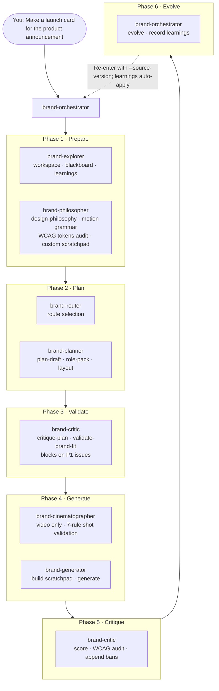

# brand-gen

[](https://www.python.org/downloads/)
[](LICENSE)
[](https://replicate.com)
[](#agent-reference)
[](#typed-runtime-the-40-verb-surface)

> A multi-agent brand design system. You talk to your agent; it runs a team of specialists - philosopher, planner, critic, cinematographer, generator - through a planning-first pipeline with quality gates.

brand-gen is **not a CLI you drive by hand**. It's a coordinated pipeline of nine specialist agents that share durable state (run ledger, blackboard, iteration memory, learnings, design tokens, policy envelope) and navigate a typed **40-verb canonical runtime** under the hood. The CLI and Python module both exist, but the typed runtime is the contract — agents call verbs like `brand_orchestrate_material`, `brand_list_runs`, `brand_get_policy` instead of editing files or scripting shell.

Works with any agent host that has shell access: Claude Code, Pi, OpenClaw, MCP hosts, Codex, Cursor.

Two assets produced end-to-end by the seven-agent pipeline from one-sentence briefs:

<p align="center">
  
  
</p>

## The agent pipeline


```mermaid
flowchart TD
    User([You: Make a launch card for the product announcement])
    User --> Orch[brand-orchestrator]

    subgraph Prepare["Phase 1 · Prepare"]
      Exp[brand-explorer<br/>workspace · blackboard · learnings]
      Phi[brand-philosopher<br/>design-philosophy · motion grammar<br/>WCAG tokens audit · custom scratchpad]
    end

    subgraph Plan["Phase 2 · Plan"]
      Rou[brand-router<br/>route selection]
      Pla[brand-planner<br/>plan-draft · role-pack · layout]
    end

    subgraph Validate["Phase 3 · Validate"]
      Cr1[brand-critic<br/>critique-plan · validate-brand-fit<br/>blocks on P1 issues]
    end

    subgraph Generate["Phase 4 · Generate"]
      Cin[brand-cinematographer<br/>video only · 7-rule shot validation]
      Gen[brand-generator<br/>build scratchpad · generate]
    end

    subgraph Critique["Phase 5 · Critique"]
      Cr2[brand-critic<br/>score · WCAG audit · append bans]
    end

    subgraph Evolve["Phase 6 · Evolve"]
      Ev[brand-orchestrator<br/>evolve · record learnings]
    end

    Orch --> Prepare --> Plan --> Validate --> Generate --> Critique --> Evolve
    Evolve -.->|"Re-enter with --source-version; learnings auto-apply"| Orch
```

<details>
<summary>Text diagram (for hosts that do not render Mermaid)</summary>

```text
You → "Make a launch card for our product announcement"
       ↓
brand-orchestrator
       ↓
┌────────────────────────────────────────────────────────────────┐
│ Phase 1 - Prepare                                              │
│   brand-explorer        workspace, blackboard, learnings       │
│   brand-philosopher     design-philosophy.md, motion grammar   │
│                         export-design-tokens + WCAG audit      │
│                         custom-scratchpad.md curation          │
│ Phase 2 - Plan                                                 │
│   brand-router          route selection                        │
│   brand-planner         plan-draft with role-pack + layout     │
│ Phase 3 - Validate                                             │
│   brand-critic          critique-plan, validate-brand-fit      │
│                         blocks on P1 issues                    │
│ Phase 4 - Generate                                             │
│   brand-cinematographer (video only) 7-rule shot validation    │
│   brand-generator       build scratchpad, generate → v1.png    │
│ Phase 5 - Critique                                             │
│   brand-critic          score, WCAG audit on HTML renders,     │
│                         append forbidden patterns, iterate     │
│ Phase 6 - Evolve                                               │
│   brand-orchestrator    evolve, record learnings               │
└────────────────────────────────────────────────────────────────┘
       ↓
You → "Tighter hierarchy, keep the copy direction"
       ↓
pipeline re-enters with --source-version, learnings auto-applied
```

</details>

The pipeline is planning-first and quality-gated: **no freehand generation before a plan is critiqued**. Agents coordinate through typed MCP verbs — the file substrate is an audit trail, not the transport layer.

## Typed runtime (the 40-verb surface)

Every agent call routes through one of 40 canonical verbs defined in `packages/brand-gen-core/src/tool-registry.ts` and bridged to Python via `brand_gen/mcp_bridge_registry.py`. Agents get a typed response with `next_action` pointing at the next call; they never need to parse bash output or guess at file paths.

| Category | Count | Examples |
|----------|-------|----------|
| **Orchestration** (stage transitions) | 7 | `brand_prepare_run`, `brand_plan_run`, `brand_validate_run`, `brand_execute_run`, `brand_review_run`, `brand_evolve_run`, `brand_orchestrate_material` |
| **Mutation** (typed state edits) | 10 | `brand_append_forbidden_pattern`, `brand_set_motion_grammar`, `brand_promote_learning`, `brand_update_palette`, `brand_submit_review`, `brand_switch_brand`, … |
| **Inspection** (read-only discovery) | 15 | `brand_list_runs`, `brand_get_run`, `brand_get_plan`, `brand_get_critique`, `brand_get_scratchpad`, `brand_get_review_packet`, `brand_get_version`, `brand_compare_versions`, `brand_list_brands`, `brand_get_pending_reviews`, `brand_context_snapshot`, `brand_show_rubric`, `brand_show_disagreements`, … |
| **Feedback** (agent ↔ user loop) | 2 | `brand_feedback`, `brand_critique_rubric` |
| **Policy** (per-brand approval envelope) | 4 | `brand_get_policy`, `brand_set_policy`, `brand_approve_action`, `brand_reject_action` |

Each tool has a `policy_class` (`read_only` / `local_mutation` / `costly_generation` / `publish_external`). Hosts flip `costly_generation` to `require_approval` in `<brand_dir>/.policy.json` when a worker (e.g. OpenClaw) should queue a human approval before spending generation tokens. `publish_external` is denied by default.

**Persistent Run state.** Every `brand_*_run` call appends to an append-only JSONL ledger under `<brand_dir>/runs/`. The projection fold (`brand_get_run`) derives `status` (`in_progress | blocked | awaiting_review | completed`), `artifact_ids`, and `lineage` so an agent can resume a run from a cold start without scanning the filesystem.

See [docs/host-setup.md](docs/host-setup.md) for the full registry and allowlist-per-agent table.

## Requirements

- Python 3.12+ (the codebase uses PEP 701 f-string features introduced in 3.12)
- [Replicate API token](https://replicate.com/account/api-tokens) (image + video generation backend)
- An agent host with shell access (Claude Code, Pi, Cursor, Codex, or any MCP host)
- ~500 MB disk for a working brand workspace

**Optional (required only if you invoke the named skill):**

- `GEMINI_API_KEY` - required when the agents invoke the `pbc-os/brand-identity` skill for Gemini-backed image generation (nano-banana path). Set in `.env`. brand-gen runs without it; the brand-identity skill refuses cleanly if missing.

## Install

```bash
git clone https://github.com/velinussage/brand-gen.git
cd brand-gen
python3 -m venv .venv && source .venv/bin/activate
python3 -m pip install -e .
cp .env.example .env          # add your REPLICATE_API_TOKEN
python3 scripts/validate_setup.py
```

## Quick start - talk to your agent

Paste this into any agent with shell access. The orchestrator will inspect the workspace, verify a design philosophy exists, plan the shot, critique the plan, generate, and critique the output - stopping for your input at critique and feedback.

```text
Read skills/brand-gen/SKILL.md and .claude/agents/brand-orchestrator.md,
then run brand-orchestrator on this task:

  Create an x-feed launch announcement for <brand>.
```

If your host supports subagent tooling directly (Claude Code, Pi):

```text
/run brand-orchestrator "x-feed launch announcement for <brand>"
```

## Skills

brand-gen ships as skill files any agent can read. No host-specific plugin required.

| Skill | Purpose |
|-------|---------|
| `skills/brand-gen-setup/SKILL.md` | First-time install and host wiring |
| `skills/brand-gen/SKILL.md` | Workspace, planning, generation, review, iteration |
| `skills/brand-gen-orchestration/SKILL.md` | Full 6-phase generation pipeline with quality gate |
| `skills/brand-gen-reference/SKILL.md` | Model specs, surface dimensions, file layout |
| `skills/brand-gen-logo/SKILL.md` | Logo and wordmark workflows |
| `skills/brand-content-ideation/SKILL.md` | Messaging and copy ideation |

## What you get

Every capability is phrased as what you, the brand maker, actually get. The infrastructure that delivers it is linked out below.

- **No freehand slop.** A critic blocks every generation until the plan passes rubric review, so you iterate on plans (seconds) not renders (minutes).
- **Brand memory that compounds.** Every approved or rejected result teaches the next run; winning setups auto-promote and auto-apply, so by version 20 you are not re-tuning what already worked at version 5.
- **A built-in quality bar.** Outputs are scored against a material-aware v2 rubric (universal axes + per-material overlays + hard disqualifiers) that the agent self-applies; the same contract drives an optional DSPy vision scorer that fills in axis scores, rationales, and a *why-a-user-might-dislike-this* field before the critic even reads the output. Feedback and agent-vs-user disagreements go into learnings automatically so the same mistake stops happening.
- **Copy that stays on-brand across sessions.** Approved taglines, headlines, and voice persist so every asset speaks with the same voice weeks apart.
- **Accessible by default.** HTML share cards consume the brand's WCAG-audited design tokens, so launch graphics do not ship with body text below 4.5:1 contrast.
- **One approved still becomes many assets.** Promote a winning design into mockups, short videos, or launch films without redrawing the core artwork.
- **Product truth, not hallucination.** A capture + reference-role workflow puts real product screenshots into the brief so the model illustrates your actual UI, not a plausible-looking fake.
- **Agents that teach each other.** The critic writes bans directly into a brand-level scratchpad; the next run auto-avoids them. Closed loop, no manual copy-paste.
- **Cinematic video by default.** Video material types route through a cinematographer that applies a motion grammar you (and the philosopher) established once, then validated seven ways before generation fires.

Three capabilities live in their own sections below because they are how the agents coordinate through shared files: the custom scratchpad, design tokens with WCAG audit, and the video pipeline.

### Custom scratchpad (how agents teach each other)

Every brand workspace carries an agent-editable scratchpad that auto-injects into every prompt and auto-applies to model selection:

```
.brand-gen/brands/<brand>/
├── custom-scratchpad.md     # style directives, motion grammar, bans
└── custom-scratchpad.json   # {model_overrides_by_material, forbidden_patterns[]}
```

- `brand-philosopher` writes style directives via `brand_append_custom_scratchpad_note` and motion grammar via `brand_set_motion_grammar`
- `brand-critic` appends forbidden patterns via `brand_append_forbidden_pattern` after any P1 finding (closed loop: critique → typed ban → next run auto-bans)
- `brand-orchestrator` reads both files in Phase 1 (via `brand_context_snapshot`) and applies model overrides before the learnings lookup

The contents land in prompt assembly alongside iteration memory and blackboard learnings. Every mutation flows through a typed verb — no agent edits JSON by hand.

### Design tokens + WCAG audit (how the philosopher gates palettes)

The philosopher runs `bgen export-design-tokens` in Step 7b of its workflow to emit production-ready tokens (CSS / Tailwind / JSON / W3C DTCG) derived mathematically from `brand-identity.json`. Every emit runs a WCAG AA audit. Errors block emission. The philosopher adjusts the palette until AA passes, at most twice, then escalates to the user with specific options.

The generator consumes the resulting `design-tokens.css` when rendering HTML materials. The critic re-runs the audit against what actually rendered.

Coverage: 50-950 shade scales, math-derived type scale, base-4 spacing, elevation shadows keyed to the brand's neutral, radii, motion tokens, breakpoints, smart font-family fallback chains. Full reference at `skills/brand-gen/references/design-tokens.md` (distilled from dylanfeltus/design-tokens, pbc-os/brand-identity, and anthropics/brand-guidelines).

Direct CLI available for scripting:

```bash
bgen export-design-tokens --output-format css       --format json
bgen export-design-tokens --output-format w3c       --format json
```

### Video materials (the cinematographer path)

For `short-video`, `derive-video`, `motion-card`, `launch-film`, `announcement-video`, or `brand-bumper`, the orchestrator inserts `brand-cinematographer` between planner and generator.

The cinematographer:

1. Reads the motion grammar that `brand-philosopher` wrote into `custom-scratchpad.md` (director token, favored camera moves, banned moves, intensity, lighting recipe, film stock, organic imperfections).
2. Assembles the six-element Seedance prompt (subject + action + setting + visual style + focal length/camera + audio).
3. Runs the seven-rule validation from `skills/brand-gen/references/seedance-shot-design.md` (length, time slices, camera literacy, filler-word bans, asset caps, conflict scan, bare-word scrub).
4. Hands a shot-ready scratchpad to `brand-generator`.

If the brand has no motion grammar, the cinematographer refuses to generate and delegates back to `brand-philosopher` to establish one. The `seedance-2-pro` model is registered in `brand_gen/models.json`. `bgen create-video` runs a brief-driven multi-shot launch film with xfade stitching and per-shot validation; every shot is gated before generation fires.

### Scoring rubric v2 + optional DSPy scorer

The v1 critic rubric (composition / material_truth / brand_coherence / restraint) overweighted craft and underweighted *did the asset actually communicate anything Sage-specific*. v2 fixes that. The rubric now lives in code at `brand_gen/scoring/rubric_registry.py` and is surfaced to every agent via `bgen show-rubric --material-type <type> --format json`, so planners, generators, and critics score against the same contract.

Universal axes (always scored 1-5): `composition`, `brand_coherence`, `restraint`, `story_fidelity`, `meaning_clarity`. `meaning_clarity` is the honest test — can a new visitor decode the image in 2-3 seconds, or is it tasteful-but-meaningless?

Per-material overlay axes + disqualifier rules add on top:

| Material | Overlay axes | Disqualifier (auto-fail) |
|----------|-------------|--------------------------|
| landing-hero | surface_fit, meaning_at_glance | no product category readable in 3s |
| concept-illustration | system_logic_visible, brand_specificity | generic abstract metaphor (floating cubes, glowing nodes, faceless figures) |
| brand-scene | process_implied, brand_specificity | pure architectural mood with no evidence of process |

Aggregation is min-biased: any axis <2 caps `overall_score` <=2, and a triggered disqualifier hard-fails with `overall_score=1`.

Optionally the critic can delegate scoring to a DSPy vision scorer that runs 5-7 axis calls + a describe + synthesize over OpenRouter (default judge: Haiku 4.5; ~$0.003 per critique with Anthropic prompt caching). Enable it with:

```bash
pip install -e '.[scoring]'
echo "OPENROUTER_API_KEY=sk-or-v1-..." >> .env
bgen critique-rubric v12 --dspy-scorer --format json
```

The scorer emits a v2 packet with `axis_scores`, `axis_rationales`, `overall_score`, `decision`, `disqualifier_triggered`, and `why_user_might_dislike_if_polished` — the field that names the failure in plain language. The critic agent still reviews the output and can override. Agent-vs-user disagreements ≥2 points auto-log to `<brand-dir>/scoring/disagreements.jsonl` and feed the calibration commands:

```bash
bgen show-rubric --material-type concept-illustration --format json
bgen show-disagreements --bucket calibration_failure --limit 20 --format json
bgen scoring-status --format json
```

Full rubric text is embedded verbatim in the three critic-agent files (`.claude/agents/brand-critic.md`, `.pi/agents/brand-critic.md`, `skills/brand-gen/claude-agents/brand-critic.md`) so the critic reads the same contract the scorer uses.

## Why not just prompt a model directly?

Single-prompt generation works fine for one-off assets. brand-gen exists for the opposite problem: you are going to make dozens of assets over months, and every one needs to feel like the same brand.

What single-prompt generation loses:

- **Brand memory.** Your last prompt does not remember the nine before it. brand-gen's iteration memory, blackboard, and learnings mean the system gets more fluent at your brand over time, not less.
- **A design philosophy.** A named aesthetic movement that makes every asset coherent instead of stylistically drifty.
- **A quality gate.** A critic that reads the plan and blocks it *before* generation when the setup is wrong, rather than spending tokens then throwing the output away.
- **WCAG accessibility.** Auto-audited palettes that fail loudly when body text drops below AA contrast, instead of silently shipping broken assets.
- **Self-improving loops.** Approved and rejected outputs auto-promote into forbidden patterns and winning setups, so the same mistake never lands twice.
- **Multi-artifact coordination.** Launch films, share cards, social sets, and mockups that all reference the same approved stills, messaging, and tokens.

If you are making one asset once, prompt a model. If you are building a brand, use a system that remembers.

## Direct CLI (for power users and scripting)

The `bgen` commands are what the agents call. You can call them too when you want to bypass the agent layer - useful for scripting, CI, or inspecting intermediate artifacts:

```bash
# Create a brand
bgen create-brand \
  --name "Acme" \
  --description "Operational software for modern field teams" \
  --tone "calm,technical,trustworthy" \
  --palette "#1A6B6B,#C85A2A"

# Run the pipeline in-process (skips agent layer, keeps planning gate)
bgen pipeline \
  --material-type x-feed \
  --goal "Launch announcement" \
  --mode hybrid \
  --format json

# Review and iterate
bgen feedback v1 --score 4 --notes "Strong direction, simplify the copy"
bgen pipeline --material-type x-feed --source-version v1 --format json
```

`bgen pipeline` runs the same planning-first gate as the agent orchestration, just without agent-level reasoning between phases. Prefer the agent path when you want the philosopher's WCAG fix, the critic's P1 push-back, or the cinematographer's shot-design validation. Use direct `bgen` calls when you already know the answers.

## Host integration

### Claude Code

Agents live at `.claude/agents/brand-*.md`. Invoke via the `Agent` tool with `subagent_type="brand-orchestrator"` or any specialist name. No extra install — the MCP server bridges Python ↔ TS automatically.

### Pi

Install the Pi plugin once from the repo root:

```bash
pi install ./packages/pi-brand-gen
```

This registers the plugin in `~/.pi/agent/settings.json::packages`, so every `pi` process — including spawned subagents — loads `brandGenPiExtension` and exposes the full 40-verb tool surface. Subagents defined under `.pi/agents/brand-*.md` read their `tools:` frontmatter against that registry; without the plugin install, the frontmatter names don't resolve and subagents fall back to `read`/`bash`/`write` built-ins.

Smoke-test with `pi list` — the entry `../../Documents/brand-gen/packages/pi-brand-gen` (or similar) should appear.

### OpenClaw

Load `packages/openclaw-brand-gen` as a plugin per your OpenClaw install docs. The plugin autodetects the brand-gen repo and launches the MCP backend as `python -m brand_gen.brand_iterate_mcp` with `cwd=<repo>` — see `packages/brand-gen-core/src/mcp-invocation.ts` for the detection logic.

### Any MCP host (manual)

For hosts that prefer a direct tool surface, run the stdio MCP server from the repo root:

```bash
python3 -m brand_gen.brand_iterate_mcp    # stdio MCP server, exposes all 40 canonical verbs
```

Always launch via `-m` module syntax, not `python brand_gen/brand_iterate_mcp.py` — the latter breaks intra-package relative imports.

See [docs/host-setup.md](docs/host-setup.md) for the full per-agent allowlist table and [docs/starter-prompts.md](docs/starter-prompts.md) for copy-paste prompts.

## Agent reference

brand-gen ships nine agent definitions across three mirrors (Claude Code, Pi, skills distribution) with identical bodies — frontmatter differs only in the tool-list format (array vs comma-string) and model tag. Other hosts can read the same files and emulate the chain manually.

- **Claude Code** - `.claude/agents/brand-*.md` (mirrored to `skills/brand-gen/claude-agents/brand-*.md`). Invoke via the `Agent` tool with `subagent_type="brand-orchestrator"` or any specialist name.
- **Pi** - `.pi/agents/brand-*.md`. Invoke via `/run brand-orchestrator <task>` or chain syntax. Requires `pi install ./packages/pi-brand-gen` first so subagents see the 40 typed verbs.

The intended entry point is always `brand-orchestrator`. It calls `brand_orchestrate_material` (one typed verb, 6-phase pipeline) and handles `stop_reason` by dispatching to mutation verbs or specialist agents — not by scripting `bgen`.

### Specialist agents

- `brand-orchestrator` - coordinates the full workflow via `brand_orchestrate_material`; in Phase 1 runs `export-design-tokens` and delegates WCAG failures to the philosopher
- `brand-explorer` - read-only workspace inspection (`brand_list_runs`, `brand_get_run`, `brand_context_snapshot`, 12 other inspection verbs)
- `brand-router` - chooses the correct route before planning (read-only over the same inspection pool as explorer)
- `brand-planner` - creates the plan draft targeting v2 rubric axes; calls `brand_plan_run` + `brand_validate_run`
- `brand-critic` - blocks bad plans via `brand_validate_run`, scores outputs via `brand_review_run`, runs WCAG contrast audits, and appends bans via typed mutation verbs (`brand_append_forbidden_pattern`, `brand_append_custom_scratchpad_note`)
- `brand-generator` - builds the scratchpad and runs generation via `brand_execute_run`; prefers the brand's `design-tokens.css` when rendering HTML
- `brand-philosopher` - owns identity palette/typography/devices (`brand_update_palette`, `brand_update_typography`, `brand_update_devices`), motion grammar (`brand_set_motion_grammar`), and custom scratchpad authoring
- `brand-cinematographer` - video-prompt specialist; reads motion grammar and the seedance shot-design reference, assembles the six-element prompt, runs seven-rule validation before handoff to `brand-generator`
- `brand-interviewer` - onboards a new brand by reverse-interview, writing identity seeds via typed update verbs; hands off to `brand-philosopher` for synthesis

### Mandatory generation sequence

For any real generation request, the intended order is:

1. **Explorer** - inspect workspace, blackboard, learnings, prior winners, references
2. **Philosopher** - verify / cultivate design philosophy; Phase 1 tokens audit (WCAG AA gate)
3. **Router** - choose the route (`reference_translate`, `generative_explore`, etc.)
4. **Planner** - run preparation and produce `plan-draft`
5. **Critic** - run `critique-plan` and `validate-brand-fit`; block if invalid
6. **Cinematographer** (video only) - run seven-rule shot-design validation
7. **Generator** - run `build-generation-scratchpad` and `generate` only after approval
8. **Critic again** - run `critique-rubric` + WCAG audit on HTML renders; decide approve vs iterate; append bans to custom-scratchpad
9. **Orchestrator** - record `feedback`, run `evolve`, and summarize

If steps 1-5 are skipped, the workflow is invalid. No freehand generation before the plan is critiqued.

### How agents map to typed verbs

Agents call canonical MCP verbs. The `bgen` CLI is a debugging fallback for operators, not the primary contract.

- `brand-explorer` → `brand_list_runs`, `brand_get_run`, `brand_context_snapshot`, `brand_show_blackboard`, `brand_show_iteration_memory` (15 inspection verbs total)
- `brand-router` → same inspection pool; emits a route decision from workspace state
- `brand-planner` → `brand_plan_run` → `brand_validate_run`; consults the rubric via `brand_show_rubric`
- `brand-critic` → `brand_validate_run` (plan gate), `brand_review_run` (v2 DSPy scorer), `brand_submit_review`, `brand_append_forbidden_pattern`, `brand_append_custom_scratchpad_note`, `brand_feedback`
- `brand-generator` → `brand_execute_run` (assembles scratchpad + generates, returns `version_id` + `image_paths`)
- `brand-philosopher` → `brand_update_palette`, `brand_update_typography`, `brand_update_devices`, `brand_set_motion_grammar`, `brand_append_custom_scratchpad_note`
- `brand-cinematographer` → `brand_execute_run` for video materials after `brand_set_motion_grammar` validation
- `brand-interviewer` → `brand_update_palette`, `brand_update_typography`, `brand_update_devices`, `brand_append_custom_scratchpad_note`
- `brand-orchestrator` → `brand_orchestrate_material` (convenience wrapper over all 7 stage verbs) + admin verbs: `brand_switch_brand`, `brand_set_policy`, `brand_approve_action`

The real flow:

```text
agents → typed verbs (MCP) → Python runtime → append-only ledger (runs/*.jsonl)
            ↓                       ↓
       next_action hint        projection via brand_get_run
```

The append-only ledger is the source of truth; the blackboard, iteration-memory, and scratchpad files are projections the agents read via typed verbs.

### Manual chain rule

If your host cannot run the agent chain automatically, emulate the same order manually:

```text
brand-explorer -> brand-router -> brand-planner -> brand-critic -> brand-generator -> brand-critic
```

Include `brand-router` in the chain. It is part of the intended process, not an optional extra.

For video materials, insert `brand-cinematographer` between planner and generator:

```text
brand-explorer -> brand-router -> brand-planner -> brand-critic -> brand-cinematographer -> brand-generator -> brand-critic
```

If the brand has no `## Motion grammar` section in its `custom-scratchpad.md`, the cinematographer will stop and delegate back to `brand-philosopher` to establish one before any video generates.

## Documentation

**For users (start here)**
- [Getting Started](docs/getting-started.md) - clone to first asset
- [Starter Prompts](docs/starter-prompts.md) - copy-paste agent prompts
- [Concepts](docs/concepts.md) - workspace, brands, sessions, blackboard

**For integrators**
- [Architecture](docs/architecture.md) - runtime layers, state model, command registry
- [CLI Reference](docs/cli-reference.md) - full command list
- [MCP Reference](docs/mcp-reference.md) - tool naming and custom tools
- [Host Setup](docs/host-setup.md) - Claude Code, Pi, OpenClaw integration
- [Skills](docs/skills.md) - loading order and skill details
- [Limitations](docs/limitations.md)

## Getting help

- Bug reports and feature requests: [github.com/velinussage/brand-gen/issues](https://github.com/velinussage/brand-gen/issues)
- Security policy: [SECURITY.md](SECURITY.md)

## Contributing

See [CONTRIBUTING.md](CONTRIBUTING.md).

## License

[MIT](LICENSE) © brand-gen maintainers
