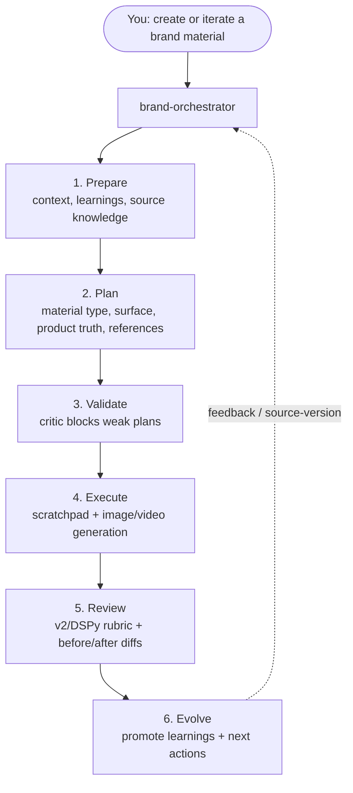

# brand-gen

[](https://www.python.org/downloads/)
[](LICENSE)
[](https://replicate.com)
[](#agent-reference)
[](#typed-runtime-45-brand-tools)

> brand-gen is a memory-backed, multi-agent brand material runtime. It helps an
> agent plan, generate, review, score, and improve brand assets without losing
> the brand's product truth, voice, visual rules, or hard-won learnings between
> sessions.

brand-gen is designed for the moment when “just prompt the image model again”
stops working. It gives your agent a structured brand workspace, a six-phase
quality gate, and a typed tool surface so every run can build on prior wins and
rejections.

Two example outputs produced by the pipeline from short briefs:

<p align="center">
  
  
</p>

## What brand-gen does

- **Plans before it generates.** The agent drafts a material plan, validates it,
  and only spends generation tokens after the plan clears blocking issues.
- **Keeps brand memory.** Positive examples, rejected examples, scratchpad notes,
  forbidden patterns, design tokens, and learnings persist in the brand workspace.
- **Uses brand-scoped source knowledge.** A brand can connect Obsidian vaults or
  docs folders; agents query them through `brand_source_knowledge` before
  planning so outputs use real product truth instead of generic diagrams.
- **Protects exact copy.** If visible text must be exact, the plan must use a
  deterministic HTML/SVG/composite/text-overlay path instead of asking an image
  model to spell.
- **Captures review data for optimization.** Reviews and disagreements preserve
  GEPA/DSPy-ready fields such as axis scores, rationales, disqualifiers, and
  before/after diffs.
- **Works across hosts.** Claude Code, Pi, OpenClaw, Codex, Cursor, and plain MCP
  hosts can all drive the same Python runtime.

## The pipeline


```mermaid
flowchart TD
    User([You: create or iterate a brand material]) --> Orch[brand-orchestrator]
    Orch --> Prep[1. Prepare<br/>context, learnings, source knowledge]
    Prep --> Plan[2. Plan<br/>material type, surface, product truth, references]
    Plan --> Validate[3. Validate<br/>critic blocks weak plans]
    Validate --> Execute[4. Execute<br/>scratchpad + image/video generation]
    Execute --> Review[5. Review<br/>v2/DSPy rubric + before/after diffs]
    Review --> Evolve[6. Evolve<br/>promote learnings + next actions]
    Evolve -. feedback / source-version .-> Orch
```

The orchestrator path is the product. The CLI exists for scripting and debug,
but agents should call typed `brand_*` tools rather than manually editing JSON or
running ad hoc shell chains.

## Install

```bash
git clone https://github.com/velinussage/brand-gen.git
cd brand-gen
python3 -m venv .venv
source .venv/bin/activate
python3 -m pip install -e .
cp .env.example .env
# Edit .env and add REPLICATE_API_TOKEN=...
python3 scripts/validate_setup.py
```

Requirements:

- Python 3.12+
- A Replicate API token for image/video generation
- An agent host with shell or MCP access
- Optional: Node.js for Pi/OpenClaw plugins
- Optional: `OPENROUTER_API_KEY` for the DSPy/VLM scorer path

## Quick start: create a brand and run it in Pi

Create a saved brand:

```bash
bgen create-brand \
  --name "Orbit Ops" \
  --description "Operational intelligence software for distributed teams." \
  --tone "calm,technical,trustworthy" \
  --palette "#1A6B6B,#C85A2A" \
  --keywords "operations,distributed systems" \
  --value-prop "Clear operational visibility"
```

brand-gen creates:

```text
.brand-gen/brands/orbit-ops/
├── brand-profile.json
├── brand-identity.json
├── prompts/pi-full-pipeline.md     # generated brand-specific Pi prompt
├── custom-scratchpad.md
├── custom-scratchpad.json
├── runs/
└── reviews/
```

Then paste the generated prompt into Pi:

```bash
cat .brand-gen/brands/orbit-ops/prompts/pi-full-pipeline.md
```

In Pi, run:

```text
/run brand-orchestrator "Create a social launch card for Orbit Ops. Make the product truth clear in under three seconds."
```

After you review the image, record feedback:

```text
Use brand_feedback on the generated version. Score it 4/5. Notes: strong trust tone; simplify the proof inset.
```

Then iterate from the source version:

```text
/run brand-orchestrator "Iterate from v001. Keep the trust tone, simplify proof, and make the headline deterministic."
```

## Quick start: testing session without committing to a saved brand

Use a testing session when you are still discovering the brand direction:

```bash
bgen start-testing \
  --working-name "Field Notes" \
  --goal "Explore a documentary-style visual identity for a field operations tool"

cat .brand-gen/sessions/field-notes/brand-materials/prompts/pi-full-pipeline.md
```

Paste that generated prompt into Pi and ask for a first material. Testing
sessions have their own prompt, memory, scratchpad, reviews, and generated
assets, so you can experiment without contaminating a saved brand.

## Sage-specific prompt vs generated brand prompts

There are two prompt types:

| Prompt | Use when | Path |
|---|---|---|
| Sage full-pipeline prompt | You are working on the built-in Sage brand | `docs/prompts/pi-sage-brand-gen-full-pipeline.md` |
| Generated brand prompt | You created or started any other brand/session | `<brand-dir>/prompts/pi-full-pipeline.md` |

Do **not** reuse the Sage prompt for unrelated brands. It contains Sage product
truth and Sage vocabulary. New brands get their own generated prompt from their
profile, approved copy, creative context, and source-knowledge configuration.

## Add brand-specific source knowledge

Use `.brand-gen-local.json` for machine-local docs or Obsidian vault paths. This
file is intentionally untracked.

```json
{
  "repo_root": "/path/to/brand-gen",
  "vault_paths": [],
  "brand_vault_paths": {
    "orbit-ops": ["/path/to/orbit-ops-vault"]
  },
  "brand_knowledge_base_paths": {
    "orbit-ops": ["/path/to/orbit-ops/docs"]
  }
}
```

Agents discover this through:

```bash
bgen context-snapshot --format json
bgen source-knowledge --query "customer proof workflow trust" --format json
```

Example agent instruction:

```text
Before planning the social asset, call brand_source_knowledge with the query
"customer proof workflow trust". Use only Orbit Ops source facts, not Sage or
other brand facts. Convert useful details into prompt seeds or scratchpad notes.
```

## Typed runtime: 45 brand tools

Every host exposes the same canonical `brand_*` tools from
`packages/brand-gen-core/src/tool-registry.ts`. The Python bridge maps those
verbs to the `bgen` runtime.

| Category | Count | Examples |
|---|---:|---|
| Orchestration | 8 | `brand_prepare_run`, `brand_plan_run`, `brand_validate_run`, `brand_execute_run`, `brand_review_run`, `brand_evolve_run`, `brand_orchestrate_material`, `brand_build_generation_scratchpad` |
| Mutation | 13 | `brand_append_forbidden_pattern`, `brand_append_custom_scratchpad_note`, `brand_update_palette`, `brand_update_typography`, `brand_set_motion_grammar`, `brand_promote_learning` |
| Inspection | 18 | `brand_context_snapshot`, `brand_source_knowledge`, `brand_list_runs`, `brand_get_run`, `brand_get_plan`, `brand_get_scratchpad`, `brand_get_version`, `brand_show_rubric`, `brand_scoring_status` |
| Policy | 4 | `brand_get_policy`, `brand_set_policy`, `brand_approve_action`, `brand_reject_action` |
| Feedback/review | 2 | `brand_feedback`, `brand_critique_rubric` |

Rules for agents:

1. Prefer `brand_orchestrate_material` for normal generation.
2. Follow each tool's `next_action` pointer.
3. Never manually edit `brand-identity.json`, `learnings.json`,
   `iteration-memory.json`, `custom-scratchpad.md`, or `custom-scratchpad.json`.
4. Never bypass blocking findings unless the user explicitly authorizes it.
5. Treat `decision: pending` or empty `axis_scores` as **not reviewed**.

See `docs/architecture/runtime-agent-contract.md` for the full contract.

## Common examples

### 1. Generate a social proof card

Agent prompt:

```text
/run brand-orchestrator "Create a 1:1 social proof card for Orbit Ops. Use one real product/proof anchor, keep proof secondary, and render exact copy deterministically."
```

Useful typed-tool flow if walking manually:

```bash
bgen context-snapshot --format json
bgen source-knowledge --query "proof customer operations workflow" --format json
bgen orchestrate-material \
  --material-type social \
  --mode hybrid \
  --purpose "social proof" \
  --target-surface "1:1 social promo" \
  --prompt-seed "Show operational trust with one concrete product proof moment." \
  --format json
```

### 2. Record a recurring failure as a durable ban

```bash
bgen append-forbidden-pattern \
  --pattern "generic four-node capability diagram without real product truth" \
  --reason "User rejected prior social direction as too generic" \
  --format json
```

### 3. Add a one-run push for the next iteration

```bash
bgen orchestrate-material \
  --material-type social \
  --source-version v012 \
  --push "Make the product proof specific: show the dispatch review workflow, not abstract network nodes." \
  --ban "generic AI network decoration" \
  --format json
```

### 4. Score and iterate

```bash
bgen feedback v012 \
  --score 2 \
  --status rejected \
  --notes "Too generic; source knowledge was not visible; exact text was weak."

bgen orchestrate-material \
  --material-type social \
  --source-version v012 \
  --push "Use source_knowledge facts and deterministic text." \
  --format json
```

### 5. Generate a video only after motion grammar exists

```bash
bgen set-motion-grammar \
  --director "restrained editorial product film" \
  --favored "slow dolly, soft parallax, clean reveal" \
  --banned "spin, whip pan, chaotic zoom, fake UI typing" \
  --intensity medium \
  --format json

bgen orchestrate-material \
  --material-type short-video \
  --mode hybrid \
  --purpose "launch teaser" \
  --target-surface "8 second social video" \
  --format json
```

## Host integration

### Claude Code

Use the `brand-orchestrator` subagent. Agent definitions live in
`.claude/agents/brand-*.md` and are mirrored under
`skills/brand-gen/claude-agents/`.

```text
Use the Agent tool with subagent_type="brand-orchestrator".
Task: Create a social launch card for Orbit Ops using the full brand-gen pipeline.
```

### Pi

Install or load the local Pi extension from `packages/pi-brand-gen`, then use the
generated prompt for the active brand:

```bash
cat .brand-gen/brands/<brand-key>/prompts/pi-full-pipeline.md
```

Inside Pi:

```text
/run brand-orchestrator "Create the requested brand material using typed brand_* tools only."
```

The Pi plugin registers all 45 canonical tools plus compatibility shims. Subagent
frontmatter in `.pi/agents/brand-*.md` should resolve against that registry.

### OpenClaw / any MCP host

Run the MCP server from the repo root:

```bash
python3 -m brand_gen.brand_iterate_mcp
```

Use module syntax (`-m`) so Python package imports resolve correctly.

## Agent reference

Nine specialist agents share the same typed runtime:

| Agent | Role |
|---|---|
| `brand-orchestrator` | Default entry point; runs the six-phase pipeline and handles stop reasons |
| `brand-explorer` | Read-only workspace, run, blackboard, and memory inspection |
| `brand-router` | Chooses the correct route/material strategy from context |
| `brand-planner` | Drafts the material plan and targets rubric axes |
| `brand-critic` | Blocks weak plans, reviews generated versions, records bans and feedback |
| `brand-generator` | Executes generation from an approved plan/scratchpad |
| `brand-philosopher` | Owns identity, palette, typography, devices, motion grammar, and source-knowledge synthesis |
| `brand-cinematographer` | Video-only shot specialist; validates motion grammar and Seedance prompt structure |
| `brand-interviewer` | Gap-fills brand identity and captures user language as durable seeds |

Manual chain for hosts without subagents:

```text
brand-explorer -> brand-philosopher -> brand-router -> brand-planner -> brand-critic -> brand-generator -> brand-critic
```

For video, insert `brand-cinematographer` before `brand-generator`.

## File layout

```text
.brand-gen/
├── config.json
├── brands/
│   └── <brand-key>/
│       ├── brand-profile.json
│       ├── brand-identity.json
│       ├── prompts/pi-full-pipeline.md
│       ├── custom-scratchpad.md
│       ├── custom-scratchpad.json
│       ├── inspiration-memory.json
│       ├── inspiration-board.json
│       ├── runs/*.jsonl
│       ├── reviews/*
│       └── v###-*.png|jpg|mp4
└── sessions/
    └── <session-key>/brand-materials/
```

Untracked local config:

```text
.brand-gen-local.json     # machine paths such as Obsidian vaults; do not commit
.env                      # API keys; do not commit
```

## Documentation

- `skills/brand-gen/SKILL.md` — main workflow for agents
- `skills/brand-gen-setup/SKILL.md` — installation and host setup
- `docs/architecture/runtime-agent-contract.md` — typed runtime rules
- `docs/architecture/source-knowledge.md` — brand-scoped vault/docs ingestion
- `docs/architecture/gepa-dspy-optimization.md` — review/disagreement records for optimizers
- `docs/prompts/pi-sage-brand-gen-full-pipeline.md` — Sage-only Pi prompt
- `docs/host-setup.md` — host adapter architecture

## Why not just prompt a model directly?

Prompt a model directly when you need one disposable image. Use brand-gen when
you need a brand system that improves over time:

- The next prompt remembers the last rejection.
- The critic blocks weak setup before money is spent.
- Exact copy is routed to deterministic rendering.
- Source docs can ground product truth.
- Design tokens and WCAG checks carry across materials.
- A winning still can become social cards, mockups, videos, and future reference
  anchors.

## Contributing

See [CONTRIBUTING.md](CONTRIBUTING.md). Run the normal checks before opening a PR:

```bash
.venv/bin/python -m pytest
npm --prefix packages/pi-brand-gen test
npm --prefix packages/brand-gen-core run typecheck
make lint
```

## License

[MIT](LICENSE) © brand-gen maintainers
