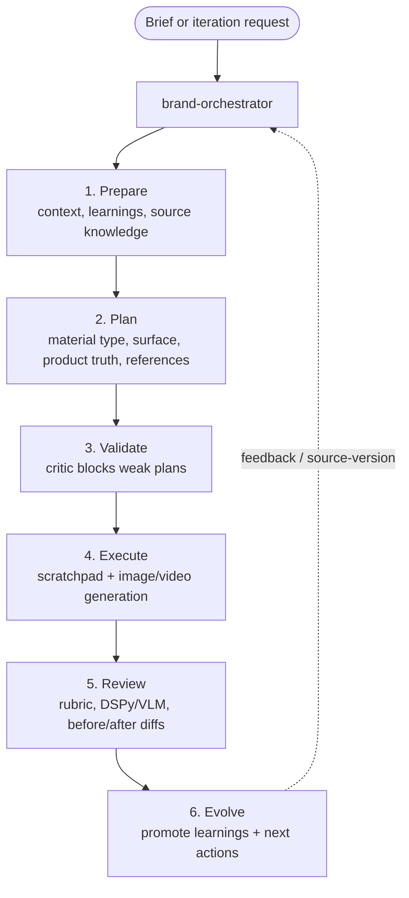

# brand-gen

[](https://www.python.org/downloads/)
[](LICENSE)
[](https://replicate.com)
[](#typed-runtime)

**A memory-backed brand generation runtime for agent-led creative iteration.**

brand-gen helps an agent plan, generate, review, score, and improve brand
materials without forgetting product truth, visual rules, exact-copy
requirements, or past user feedback. It is built for teams that have moved past
one-off image prompting and need a repeatable brand workflow that learns across
sessions.

[Quick start](#quick-start) • [How it works](#how-it-works) • [Examples](#examples) • [Pi setup](#pi-agent-setup) • [Docs](#documentation)

## Why brand-gen?

Image models are good at producing a single artifact. Brand work needs a system:
briefs, source knowledge, approved copy, references, design tokens, critiques,
rejections, and iteration memory. brand-gen gives agent hosts a typed runtime for
that loop.

- **Ground every run in brand memory** — profiles, design tokens, scratchpads,
  examples, bans, review history, and source knowledge all live in the workspace.
- **Plan before spending generation tokens** — the six-phase pipeline validates a
  material plan before image/video generation starts.
- **Protect exact text** — visible copy can be routed to deterministic HTML, SVG,
  composite, or overlay flows instead of asking an image model to spell.
- **Use brand-specific knowledge bases** — connect Obsidian vaults or docs
  folders per brand and query them through `brand_source_knowledge`.
- **Capture optimizer-ready review data** — reviews preserve axis scores,
  rationales, disqualifiers, before/after diffs, and disagreement records for
  GEPA/DSPy-style prompt improvement.
- **Run from multiple agent hosts** — Claude Code, Pi, OpenClaw, Codex, Cursor,
  and plain MCP hosts can call the same Python runtime.

## Quick start

### Requirements

| Requirement | Why it is needed |
|---|---|
| Python 3.12+ | Runs the `bgen` CLI and MCP bridge |
| Replicate API token | Image/video generation backend |
| Agent host | Pi, Claude Code, OpenClaw, Codex, Cursor, or any MCP client |
| Node.js | Optional; needed for Pi/OpenClaw package tests and adapters |
| `OPENROUTER_API_KEY` | Optional; enables DSPy/VLM scoring paths |

### Install

```bash
git clone https://github.com/velinussage/brand-gen.git
cd brand-gen

python3 -m venv .venv
source .venv/bin/activate
python3 -m pip install -e .

cp .env.example .env
# Edit .env and add REPLICATE_API_TOKEN=...

python3 scripts/validate_setup.py
```

### Create a brand

```bash
bgen create-brand \
  --name "Orbit Ops" \
  --description "Operational intelligence software for distributed teams." \
  --tone "calm,technical,trustworthy" \
  --palette "#1A6B6B,#C85A2A" \
  --keywords "operations,distributed systems" \
  --value-prop "Clear operational visibility"
```

This creates a brand workspace:

```text
.brand-gen/brands/orbit-ops/
├── brand-profile.json
├── brand-identity.json
├── prompts/pi-full-pipeline.md
├── custom-scratchpad.md
├── custom-scratchpad.json
├── runs/
└── reviews/
```

### Run the generated Pi prompt

Every brand gets its own Pi prompt. Use that generated prompt instead of copying
a prompt from another brand.

```bash
cat .brand-gen/brands/orbit-ops/prompts/pi-full-pipeline.md
```

Paste the prompt into Pi, then ask the orchestrator for a material:

```text
/run brand-orchestrator "Create a 1:1 social launch card for Orbit Ops. Make the product truth clear in under three seconds."
```

After reviewing the image, record feedback and iterate:

```text
Use brand_feedback on the generated version. Score it 4/5. Notes: strong trust tone; simplify the proof inset.

/run brand-orchestrator "Iterate from v001. Keep the trust tone, simplify proof, and make the headline deterministic."
```

## How it works

The orchestrator runs a six-phase quality gate. The CLI exists for scripting and
debugging, but agents should call typed `brand_*` tools whenever the host
supports them.


```mermaid
flowchart TD
    User([Brief or iteration request]) --> Orch[brand-orchestrator]
    Orch --> Prep[1. Prepare<br/>context, learnings, source knowledge]
    Prep --> Plan[2. Plan<br/>material type, surface, product truth, references]
    Plan --> Validate[3. Validate<br/>critic blocks weak plans]
    Validate --> Execute[4. Execute<br/>scratchpad + image/video generation]
    Execute --> Review[5. Review<br/>rubric, DSPy/VLM, before/after diffs]
    Review --> Evolve[6. Evolve<br/>promote learnings + next actions]
    Evolve -. feedback / source-version .-> Orch
```

### Core concepts

| Concept | Description |
|---|---|
| **Brand workspace** | A persistent folder containing profile, identity, runs, reviews, scratchpads, examples, and generated artifacts. |
| **Typed runtime** | The canonical `brand_*` tool surface shared by Pi, Claude, MCP hosts, and the Python CLI bridge. |
| **Source knowledge** | Optional brand-scoped docs/vault paths that agents query before planning. |
| **Scratchpad** | A per-run planning artifact that captures prompt seeds, references, copy requirements, bans, and selected inspirations. |
| **Review packet** | A structured critique target with rubric axes, disqualifiers, and fields ready for optimizer loops. |
| **Learning promotion** | Durable positive/negative lessons promoted from reviews into future runs. |

## Examples

### Generate a social proof card

Agent prompt:

```text
/run brand-orchestrator "Create a 1:1 social proof card for Orbit Ops. Use one real product/proof anchor, keep proof secondary, and render exact copy deterministically."
```

Manual CLI flow for debugging:

```bash
bgen context-snapshot --format json
bgen source-knowledge --query "proof customer operations workflow" --format json
bgen orchestrate-material \
  --material-type social \
  --mode hybrid \
  --purpose "social proof" \
  --target-surface "1:1 social promo" \
  --prompt-seed "Show operational trust with one concrete product proof moment." \
  --format json
```

### Start a temporary testing session

Use this when you are still discovering a brand direction and do not want to
commit to a saved brand yet.

```bash
bgen start-testing \
  --working-name "Field Notes" \
  --goal "Explore a documentary-style identity for a field operations tool"

cat .brand-gen/sessions/field-notes/brand-materials/prompts/pi-full-pipeline.md
```

Testing sessions keep their own prompt, memory, scratchpad, reviews, and assets.

### Record a recurring failure as a durable ban

```bash
bgen append-forbidden-pattern \
  --pattern "generic four-node capability diagram without real product truth" \
  --reason "User rejected prior social direction as too generic" \
  --format json
```

### Add a one-run push for the next iteration

```bash
bgen orchestrate-material \
  --material-type social \
  --source-version v012 \
  --push "Show the dispatch review workflow, not abstract network nodes." \
  --ban "generic AI network decoration" \
  --format json
```

### Score and iterate

```bash
bgen feedback v012 \
  --score 2 \
  --status rejected \
  --notes "Too generic; source knowledge was not visible; exact text was weak."

bgen orchestrate-material \
  --material-type social \
  --source-version v012 \
  --push "Use source_knowledge facts and deterministic text." \
  --format json
```

### Generate video after motion grammar exists

```bash
bgen set-motion-grammar \
  --director "restrained editorial product film" \
  --favored "slow dolly, soft parallax, clean reveal" \
  --banned "spin, whip pan, chaotic zoom, fake UI typing" \
  --intensity medium \
  --format json

bgen orchestrate-material \
  --material-type short-video \
  --mode hybrid \
  --purpose "launch teaser" \
  --target-surface "8 second social video" \
  --format json
```

## Example outputs

The README intentionally keeps visuals out of the hero so the first screen stays
usable. Generated examples live here instead:

| Social card | Brand scene |
|---|---|
|  |  |

## Source knowledge

Use `.brand-gen-local.json` for machine-local docs or Obsidian vault paths. This
file is intentionally untracked.

```json
{
  "repo_root": "/path/to/brand-gen",
  "vault_paths": [],
  "brand_vault_paths": {
    "orbit-ops": ["/path/to/orbit-ops-vault"]
  },
  "brand_knowledge_base_paths": {
    "orbit-ops": ["/path/to/orbit-ops/docs"]
  }
}
```

Agents can discover and query the configured knowledge bases:

```bash
bgen context-snapshot --format json
bgen source-knowledge --query "customer proof workflow trust" --format json
```

Recommended agent instruction:

```text
Before planning the social asset, call brand_source_knowledge with the query
"customer proof workflow trust". Use only Orbit Ops source facts, not facts from
another brand. Convert useful details into prompt seeds or scratchpad notes.
```

## Typed runtime

Every host exposes the same canonical `brand_*` tools from
`packages/brand-gen-core/src/tool-registry.ts`. The Python bridge maps those
verbs to the `bgen` runtime.

| Category | Count | Examples |
|---|---:|---|
| Orchestration | 8 | `brand_prepare_run`, `brand_plan_run`, `brand_validate_run`, `brand_execute_run`, `brand_review_run`, `brand_evolve_run`, `brand_orchestrate_material`, `brand_build_generation_scratchpad` |
| Mutation | 13 | `brand_append_forbidden_pattern`, `brand_append_custom_scratchpad_note`, `brand_update_palette`, `brand_update_typography`, `brand_set_motion_grammar`, `brand_promote_learning` |
| Inspection | 18 | `brand_context_snapshot`, `brand_source_knowledge`, `brand_list_runs`, `brand_get_run`, `brand_get_plan`, `brand_get_scratchpad`, `brand_get_version`, `brand_show_rubric`, `brand_scoring_status` |
| Policy | 4 | `brand_get_policy`, `brand_set_policy`, `brand_approve_action`, `brand_reject_action` |
| Feedback/review | 2 | `brand_feedback`, `brand_critique_rubric` |

Agent rules:

1. Prefer `brand_orchestrate_material` for normal generation.
2. Follow each tool's `next_action` pointer.
3. Never manually edit `brand-identity.json`, `learnings.json`,
   `iteration-memory.json`, `custom-scratchpad.md`, or `custom-scratchpad.json`.
4. Never bypass blocking findings unless the user explicitly authorizes it.
5. Treat `decision: pending` or empty `axis_scores` as **not reviewed**.

See `docs/architecture/runtime-agent-contract.md` for the full contract.

## Agent and host setup

### Pi agent setup

Install or load the local Pi extension from `packages/pi-brand-gen`, then use the
generated prompt for the active brand:

```bash
cat .brand-gen/brands/<brand-key>/prompts/pi-full-pipeline.md
```

Inside Pi:

```text
/run brand-orchestrator "Create the requested brand material using typed brand_* tools only."
```

The Pi plugin registers all 45 canonical tools plus compatibility shims. Subagent
frontmatter in `.pi/agents/brand-*.md` should resolve against that registry.

### Claude Code

Use the `brand-orchestrator` subagent. Agent definitions live in
`.claude/agents/brand-*.md` and are mirrored under
`skills/brand-gen/claude-agents/`.

```text
Use the Agent tool with subagent_type="brand-orchestrator".
Task: Create a social launch card for Orbit Ops using the full brand-gen pipeline.
```

### OpenClaw or any MCP host

Run the MCP server from the repo root:

```bash
python3 -m brand_gen.brand_iterate_mcp
```

Use module syntax (`-m`) so Python package imports resolve correctly.

## Agent reference

Nine specialist agents share the same typed runtime:

| Agent | Role |
|---|---|
| `brand-orchestrator` | Default entry point; runs the six-phase pipeline and handles stop reasons |
| `brand-explorer` | Read-only workspace, run, blackboard, and memory inspection |
| `brand-router` | Chooses the correct route/material strategy from context |
| `brand-planner` | Drafts the material plan and targets rubric axes |
| `brand-critic` | Blocks weak plans, reviews generated versions, records bans and feedback |
| `brand-generator` | Executes generation from an approved plan/scratchpad |
| `brand-philosopher` | Owns identity, palette, typography, devices, motion grammar, and source-knowledge synthesis |
| `brand-cinematographer` | Video-only shot specialist; validates motion grammar and Seedance prompt structure |
| `brand-interviewer` | Gap-fills brand identity and captures user language as durable seeds |

Manual chain for hosts without subagents:

```text
brand-explorer -> brand-philosopher -> brand-router -> brand-planner -> brand-critic -> brand-generator -> brand-critic
```

For video, insert `brand-cinematographer` before `brand-generator`.

## File layout

```text
.brand-gen/
├── config.json
├── brands/
│   └── <brand-key>/
│       ├── brand-profile.json
│       ├── brand-identity.json
│       ├── prompts/pi-full-pipeline.md
│       ├── custom-scratchpad.md
│       ├── custom-scratchpad.json
│       ├── inspiration-memory.json
│       ├── inspiration-board.json
│       ├── runs/*.jsonl
│       ├── reviews/*
│       └── v###-*.png|jpg|mp4
└── sessions/
    └── <session-key>/brand-materials/
```

Untracked local config:

```text
.brand-gen-local.json     # machine paths such as Obsidian vaults; do not commit
.env                      # API keys; do not commit
```

## Prompt types

| Prompt | Use when | Path |
|---|---|---|
| Generated brand prompt | You created or started any non-Sage brand/session | `<brand-dir>/prompts/pi-full-pipeline.md` |
| Sage full-pipeline prompt | You are working on the built-in Sage brand only | `docs/prompts/pi-sage-brand-gen-full-pipeline.md` |

Do **not** reuse the Sage prompt for unrelated brands. It contains Sage product
truth and Sage vocabulary. New brands get generated prompts from their own
profile, approved copy, creative context, and source-knowledge configuration.

## Documentation

- `skills/brand-gen/SKILL.md` — main workflow for agents
- `skills/brand-gen-setup/SKILL.md` — installation and host setup
- `docs/architecture/runtime-agent-contract.md` — typed runtime rules
- `docs/architecture/source-knowledge.md` — brand-scoped vault/docs ingestion
- `docs/architecture/gepa-dspy-optimization.md` — review/disagreement records for optimizers
- `docs/prompts/pi-sage-brand-gen-full-pipeline.md` — Sage-only Pi prompt
- `docs/host-setup.md` — host adapter architecture

## When not to use brand-gen

Use a direct image prompt instead when you need one disposable concept, do not
care about preserving feedback, and have no product truth or exact-copy
requirements. Use brand-gen when the work needs memory, review gates, source
knowledge, deterministic text handling, or cross-material consistency.

## Contributing

See [CONTRIBUTING.md](CONTRIBUTING.md). Run the normal checks before opening a PR:

```bash
.venv/bin/python -m pytest
npm --prefix packages/pi-brand-gen test
npm --prefix packages/brand-gen-core run typecheck
make lint
```

## License

[MIT](LICENSE) © brand-gen maintainers
