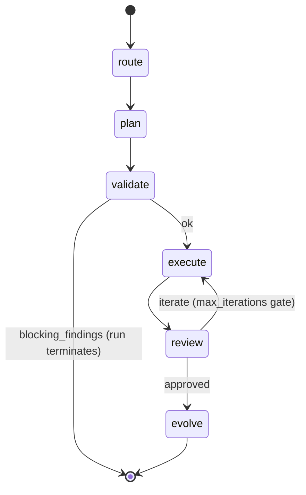

# Brand-Gen Loop-Shape Assessment

**Risk addressed:** the route → plan → critique → scratchpad → generate flow is a **sequential mutation pipeline, not a feedback graph**. Each phase reads the previous JSON file and writes a new one. Critique is in-line and one-shot (`pipeline_runner._run_critique`); it cannot iterate the plan. Auto-feedback writes to iteration_memory which is read at *next-run* prompt assembly time. There is no in-flight "the critique fixed the plan" loop except for legacy VLM. `max_iterations` re-runs only `_run_generate`, not the planning phases. `PipelineResult` carries a single artifact set, not a candidate set.

The whole system models taste as a one-pass refinement — but the actual problem (aesthetic convergence) requires loops at the plan layer.

## What this skill produces

```json
{
  "summary": {
    "phases": ["route", "plan", "validate", "execute", "review", "evolve"],
    "phase_can_reenter_predecessor": false,
    "pipeline_result_carries_candidate_set": false,
    "scoring_feeds_into_route": false,
    "scoring_feeds_into_plan_in_same_run": false,
    "max_iterations_scope": "execute_only",
    "in_run_loops": [
      { "name": "max_iterations", "scope": "execute → review → execute", "controlled_by": "iteration count" }
    ],
    "across_run_loops": [
      { "name": "iteration_memory feedback", "scope": "next run's prompt assembly reads prior negatives" },
      { "name": "learnings promotion", "scope": "evolve writes to learnings.json; future runs prepare-phase reads it" }
    ]
  },
  "actual_state_machine": "(mermaid or graph dsl describing today's flow)",
  "desired_state_machine": "(graph showing plan↻ on critique block, candidate-set carried, scoring feedback into plan)",
  "delta": [
    {
      "transition": "validate.blocking → plan",
      "today": "blocking_findings → stop_reason; user must re-invoke orchestrate-material",
      "desired": "in-run plan revision driven by blocking findings",
      "minimum_change": "PipelineRunner._run_critique returns plan_revisions; runner re-enters _run_plan"
    },
    {
      "transition": "review.iterate → plan",
      "today": "iteration_memory mutated; loop exits; next run reads memory",
      "desired": "in-run plan revision driven by review.before_after_diffs",
      "minimum_change": "max_iterations covers plan re-entry; PipelineResult carries iteration_history"
    },
    {
      "transition": "execute → multiple_candidates",
      "today": "PipelineResult.artifacts is a single set; multi-candidate work is multiple runs",
      "desired": "PipelineResult.candidates: List[CandidateResult] when an Experiment is active",
      "minimum_change": "AestheticExperiment from brand-gen-experiment-modeling + List wrapper on artifacts"
    }
  ],
  "non_loops": [
    "scoring → route (would let the system reroute when a scored direction underperforms; doesn't exist)",
    "scoring → plan (in-run; would close the convergence loop; doesn't exist)"
  ],
  "blast_radius": {
    "introducing_plan_loop": "max_iterations semantics, PipelineResult shape, run_ledger schema",
    "introducing_candidate_set": "PipelineResult.artifacts, every consumer of artifacts (UI, MCP, brand-orchestrator)"
  }
}
```

## When to use

- Before claiming the auto-feedback loop is "closed" (it's open across runs only).
- Before promising aesthetic convergence to a user.
- Before raising `max_iterations` — to know whether more iterations actually help.
- Before adding a new phase — to know whether it slots into the linear chain or needs a back-edge.

## Inputs

- Repo path (default `$PWD`).
- Optional `--diagram-format` — `mermaid` (default) or `dot`.

## Procedure

1. **Enumerate phases.** Read `brand_gen/pipeline_runner.py`. Identify every `_run_<phase>` method. Capture the input/output shape and where the result is written (typically a JSON file in the brand workspace).

2. **Detect in-run back-edges.** For each phase, check whether the runner's controller (`run`/`orchestrate`) can re-invoke an earlier phase based on the current phase's output. The only known back-edge is `max_iterations` re-running `_run_generate` — verify scope and exit conditions. For each phase, record `can_reenter_from = []` or list the phases that can branch back.

3. **Detect across-run loops (background).** These are not in-run feedback but are part of the loop story:
   - iteration_memory write (review/evolve) → iteration_memory read (next run's plan/prompt assembly).
   - learnings.json write (evolve) → learnings read (next run's prepare).
   - blackboard updates (any phase) → next-run blackboard read.
   List each, scope, and what it carries.

4. **Audit `PipelineResult` shape.** Read `pipeline_types.py` `PipelineResult` declaration. Check `artifacts`, `next_action`, `stop_reason`, `iteration_history` (if exists). Determine whether the shape supports multi-candidate output. If `artifacts` is singular, mark "carries_candidate_set: false".

5. **Audit scoring → route/plan paths.** Grep for `BrandScorer`, `axis_scores`, `decision: 'iterate'`. Walk forward from each scoring output and check whether any in-run consumer is `_run_route` or `_run_plan`. (Across-run consumption via iteration_memory does not count.)

6. **Build the actual state machine.** Render as mermaid:



7. **Build the desired state machine.** Add the missing back-edges:
   - `validate → plan` on blocking findings (in-run revision).
   - `review → plan` on iterate (in-run plan refinement, not just re-execute).
   - `evolve → route` on persistent low scores (re-strategize before next run).
   - `execute` → `execute` parallel branches when an Experiment is active.
   - `PipelineResult.candidates` instead of single `artifacts`.

8. **Compute the delta.** For each missing back-edge, capture the minimum change (function signature, runner control flow, result shape) and the blast radius (which consumers break).

## Reference files

- `brand_gen/pipeline_runner.py` (full file, especially `_run_*` methods and the `run`/`orchestrate` controllers).
- `brand_gen/pipeline_types.py` — `PipelineResult` shape.
- `brand_gen/generation_flow.py:1077, 1117` — `auto_capture_generation_feedback`, `auto_capture_vlm_feedback` (the across-run loop closures).
- `brand_gen/iteration_memory.py` — across-run carrier.
- `brand_gen/run_ledger.py` — what gets persisted; informs what a new in-run loop must record.

## Don't

- Don't rewrite `pipeline_runner.py`. Output the diagrams and delta. Implementation belongs to `compound-engineering:ce-plan` after this assessment.
- Don't conflate across-run feedback (which exists, weakly) with in-run feedback (which doesn't, except `max_iterations`).
- Don't recommend a `validate → route` back-edge. Routing is upstream-of-everything; if validate fails because the route was wrong, that's a re-invocation, not a loop.
- Don't run this skill before `brand-gen-experiment-modeling` if the desired-state diagram will reference an Experiment abstraction — produce that recommendation first.
